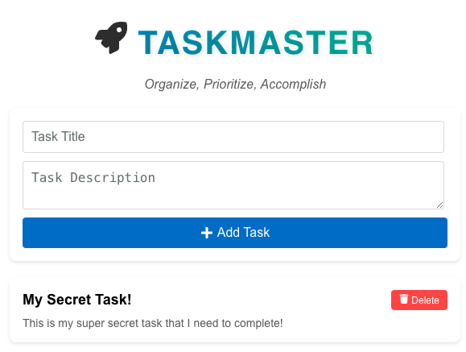

# Basic Template

In this example you will build the TaskMaster application!

To execute this project please:

1. Open the [basic-backend](./basic-backend/README.md) folder with instructions to execute the backend locally.
2. Open the [basic-frontend](./basic-frontend/README.md) folder with instructions to execute the front end and run your web applicaation locally.

We have recorded a video in our [DynamoDB Nuggets]() playlist that talks about this example in detail.

