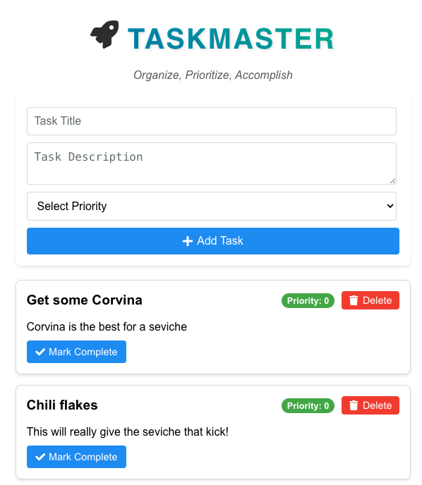

# Enhanced Template

In this example you will build the TaskMaster application!

To execute this project please:

1. Open the [enhanced-backend](./enhanced-backend/README.md) folder with instructions to execute the backend locally.
2. Open the [enhanced-frontend](./enhanced-frontend/README.md) folder with instructions to execute the front end and run your web applicaation locally.
