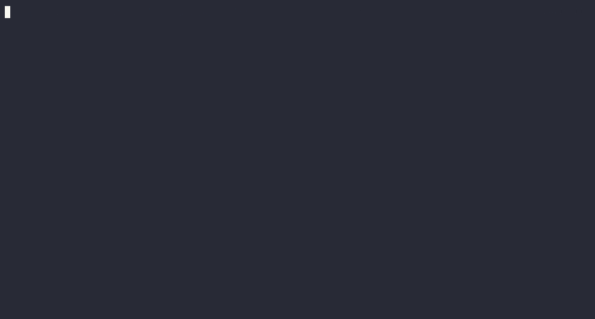

# Recipes Backend Example

## Description

This project is a backend service for a recipe management system, built using AWS SAM (Serverless Application Model) and DynamoDB as part of the NERDS stack.

## Prerequisites

- [Docker Desktop](https://www.docker.com/products/docker-desktop/)
- [DynamoDB Local Docker Image](https://hub.docker.com/r/amazon/dynamodb-local)
- [Node v22.3.0](https://nodejs.org/en/blog/release/v22.3.0)
- [AWS JavaScript SDK v3](https://docs.aws.amazon.com/AWSJavaScriptSDK/v3/latest/client/dynamodb/)
- [AWS SAM CLI](https://docs.aws.amazon.com/serverless-application-model/latest/developerguide/install-sam-cli.html)

## Setup

1. Install dependencies:

```bash
npm install
```

2. Start the local DynamoDB:

```bash
npm run start-db
```

3. Create the recipes table:

```bash
npm run create-recipes-table
```

4. Build the SAM application:

```bash
npm run build-backend
```

5. Start the local API:

```bash
npm run start-backend
```

# Setup



# Creating an user


## Available Scripts

- `npm run start-db`: Start local DynamoDB container
- `npm run stop-db`: Stop and remove local DynamoDB container
- `npm run create-recipes-table`: Create the recipes table in local DynamoDB
- `npm run show-tables`: List tables in local DynamoDB
- `npm run scan-recipes`: Scan all items in the recipes table
- `npm run build-backend`: Build the SAM application, if you change the code in the `src/*` folder you need to rebuild your project.
- `npm run start-backend`: Start the local API
- `npm run create-user`: Create a sample user using curl

## Configuration

The project uses the following configuration (defined in package.json):

- DynamoDB host: `0.0.0.0`
- DynamoDB port: `8000`
- API port: `3000`
- Recipe table name: `recipe_table`

## API Endpoints

- `POST /users`: Create a new user
- `GET /users/{userId}`: Get user details
- `PUT /users/{userId}`: Update user details
- `DELETE /users/{userId}`: Delete a user
- `POST /recipes`: Create a new recipe
- `GET /recipes/{recipeId}`: Get recipe details
- `PUT /recipes/{recipeId}`: Update recipe details
- `DELETE /recipes/{recipeId}`: Delete a recipe
- `GET /recipes`: List all recipes

## Development

To start development:

1. Ensure local DynamoDB is running (`npm run start-db`)
2. Make changes to the Lambda functions in the `src` directory
3. Rebuild the application (`npm run build-backend`)
4. Start the local API (`npm run start-backend`)
5. Test your changes using the provided npm scripts or tools like Postman

## Sample Data

Please notice that we will be updating the sample data while we introduce new functionality.

### Release one (user and recipes)

#### User information

```json
{
  "email": "user@example.com",
  "name": "John Doe",
  "nickname": "thedoe",
  "dietaryPreferences": [],
  "description": "Welcome to my recipe page! I hope you enjoy my food!",
  "pictureUrl": "url path",
  "profileThumbnails": "url path"
}
```

#### New Recipe

```json
{
  "recipeName": "Fish and Chips",
  "recipeDescription": "The best fish and chips you will ever taste",
  "recipePrepTime": 40,
  "recipeCookTime": 10,
  "ingridients": [
    { "Cod": 1, "units": "piece", "comment": "Don't use frozen pieces" },
    { "Potatoes": 1, "units": "piece", "comment": "1 large" },
    { "Oil": 20, "units": "oz", "comment": "Frying oil, use your favorite" }
  ],
  "recipeComments": 0,
  "recipeReactions": { "likes": 0 },
  "recipeStars": 5,
  "recipePresentation": "I really love fish and chips, this is my recipe",
  "recipeDescription": "Welcome to my recipe page! I hope you enjoy my food!",
  "recipePictureUrl": "url path",
  "recipeThumbnails": "url path",
  "recipePhotos": ["url path", "url path"]
}
```
