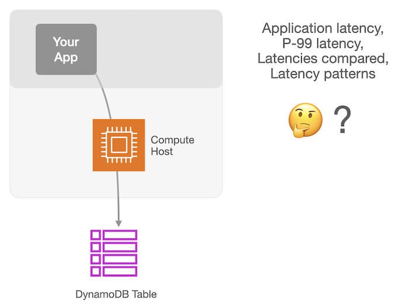

## Tester 
**HOME** - [Setup](./setup/README.md) - [Jobs](./jobs/README.md) - [Charts](./app/README.md)

Take Amazon DynamoDB for a test drive with this benchmarking solution. As a database scientist, you can craft two similar experiments, with one being the control. The other experiment can introduce an API feature, table configuration, or design decision that you wish to understand better. Run experiment jobs from your application host, and the latencies of each request will be recorded in a file. Then you can view summary statistics and interactive charts using an included web app.

## Scenario
You, as a database developer, have just taken a new role within a large engineering team. The team has been researching DynamoDB to learn more about its characteristics, and wants to know whether it would meet their application's strict performance requrements, for a possible database migration.

After orientation, your new manager calls you over to show what they have discovered in the AWS Console's DynamoDB section. A Monitoring tab shows a dashboard of charts, including latency charts for read and write requests. 

While the Cloudwatch charts work fine, they aren't able to show the full latency picture as experienced by the application. This would include the network hop delay, and delay for any retries required, in addition to DynamoDB's self-measured request latency. 

As you discuss the team's database performance requirements, additional questions come to mind.

### Questions
 * How can we see the full round-trip latency an application running on EC2 would observe when making DynamoDB requests across the network?

 * How can we see results with per-second or per-request granularity?

 * How could we see the normal distribution of all latencies to understand average and tail latency?

 * How could we see, in a single chart, the relative performance of various features, request types, request sizes, table configurations, and regions? 

#### Questions when considering DynamoDB [Global Tables](https://docs.aws.amazon.com/amazondynamodb/latest/developerguide/GlobalTables.html) with [Multi-Region Strong Consistency](https://docs.aws.amazon.com/amazondynamodb/latest/developerguide/multi-region-strong-consistency-gt.html).

 * What is the latency profile of a GT MRSC (two-region) write, versus a single-region table write?
  
 * What would be the average latency for an application to perform a strongly consistent read of an item of size N?

 * What would be the write latency difference when using us-east-1 versus us-west-2?
 
 * Are conditional writes any slower than regular MRSC writes?

## Tester framework: 

This testing framework will allow you to:

* Run jobs measuring read and write performance
* Review latency results charted in a custom web app
* See analysis showing average, p99, and max latency, latency distributions
* Compare multiple test runs side by side

Ready? 
Head over to the [Setup](./setup/README.md) page.
