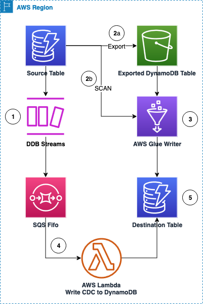

# Migration Playbook

Today, there is no automatic migration mechanism that allows to migrate an [Amazon DynamoDB](https://docs.aws.amazon.com/amazondynamodb/latest/developerguide/Introduction.html) table from an Amplify Project to an infrastructure managed by the [Cloud Development Kit - CDK](https://docs.aws.amazon.com/cdk/v2/guide/home.html). To avoid production impact it is recommended to create a parallel environment that will be managed by the CDK, where the table's data will be synchronized across environments.

As for the date of creation of this playbook, there is no an automated tool that allows restoring a DynamoDB table into a CloudFormation or CDK managed resource. When you restore to a new table using PITR (Point in Time recovery), import data from S3 or restore an snapshot you will need to restore the resource to a new DynamoDB table, and afterwards import the existing resource into your CDK of CF resource.

## Assumptions

- The infrastructure (tables) will be created outside the scope of this playbook/solution. You must have two tables, your source table with all the informaton, and your destination table, empty but with the same primary key and indexes.
- The DynamoDB tables and indexes will remain the same, no primary key modification.
- There will be no access pattern modification and the data will remain as is.
- This procedure requires the table(s) to exist(s) before it is executed.
- An external synchronization mechanism will be created to migrate each one of the DynamoDB tables, this mechanism will not be controlled by Amplify CLI, nor the new CDK stack that holds the new infrastructure.
- All the source DynamoDB tables have point in time recovery [(PITR)](https://docs.aws.amazon.com/amazondynamodb/latest/developerguide/Point-in-time-recovery.html) enabled and DynamoDB Streams.

## High-level architecture design

The synchronization process is executed per table, it consists of two steps, one data load and the [change data capture](https://docs.aws.amazon.com/amazondynamodb/latest/developerguide/streamsmain.html) to keep the tables in sync until required, once the first data load is completed CDC should remain enabled until the migration is completed and there is no more traffic from the source table.

The entire process is orchestrated through AWS Step Functions via a State Machine. Through CDK, all resources are created:

- AWS Step Functions: The workflow service tracking the migration phase, and assisting with monitoring and re-driving any failures
- DynamoDB built-in features:
  - <ins>DynamoDB Export to S3 API and DynamoDB Scan API</ins>: The DynamoDB [`ExportTableToPointInTime`](https://docs.aws.amazon.com/amazondynamodb/latest/APIReference/API_ExportTableToPointInTime.html) API is used to export tables to S3 that are greater than 80GB in size. For tables that are smaller, we use the [`Scan`](https://docs.aws.amazon.com/amazondynamodb/latest/APIReference/API_Scan.html) API to read from DynamoDB directly
  - <ins>[DynamoDB Streams](https://docs.aws.amazon.com/amazondynamodb/latest/developerguide/Streams.html)</ins>: providing a 24-hour CDC stream, we use Streams to capture changes to the source table to replicate to the destination, via SQS FIFO
- <ins>[Amazon SQS FIFO queue](https://docs.aws.amazon.com/AWSSimpleQueueService/latest/SQSDeveloperGuide/sqs-fifo-queues.html)</ins>: We create a SQS FIFO queue to store changes from the DynamoDB Stream. An AWS Lambda function on the DynamoDB stream puts changes into a SQS FIFO queue for eventual replication, once the import is complete
- <ins>[AWS Glue ETL](https://aws.amazon.com/glue/)</ins>: We have two Python Glue scripts, and pick which to use based on the table size <> 80GB:
  - For small tables (and for MVP) we use direction migration, and the `DirectMigrationJob` uses the DynamoDB Scan API with [`BatchWriteItem`](https://docs.aws.amazon.com/amazondynamodb/latest/APIReference/API_BatchWriteItem.html) to insert items into the destination DynamoDB table.
  - For large tables, we use `LargeMigrationJob` to export the table to S3 and the use the same BatchWriteItem API to insert new items into the destination DynamoDB table
- <ins>[AWS Lambda](https://aws.amazon.com/pm/lambda/)</ins> (each function listed in approximate execution order in the Step Functions state machine):
  - [`SetupCheck`](../lambda/setup-check/index.py): This Lambda function ensures DynamoDB Streams and, for large tables, PITR is enabled
  - [`StreamProcessor`](../lambda/stream-processor/index.py): This reads records from the DynamoDB stream and writes them SQS FIFO. Once the import is complete to the destination table, the EnableTrigger function is executed to connect the SQS FIFO queue to the WriteCdc function to begin continuous replication
  - [`EnableTrigger`](../lambda/enable-trigger/index.py): This Lambda connects the SQS FIFO queue to the WriteCDC function at the end of the import
  - [`WriteCdc`](../lambda/write-cdc/index.py): This is the final Lambda function which writes changes from the FIFO queue to the destination DynamoDB table

For background, there are two options for the CDC: Amazon DynamoDB Streams or use Kinesis Data Streams (KDS). More information is available on this [video](https://youtu.be/UgG17Wh2y0g?si=mcBLljJ_1_YmtGst) for a comparison between them. The choice of a solution will depend of your data velocity and size, however DynamoDB Streams promises every change appears exactly once and will be used by this playbook.

> ℹ️ NOTE: DynamoDB Streams has a retention period of 24 hours, but we copy changes in SQS Fifo to get 4 days of retention out of the box. This gives us a theoretical total of 5 days to do the bulk copy from the source to destination table

This is the list of the high steps this solution automates with AWS Step Functions to migrate information from one table to another with near zero downtime:

1. Ensure the Source Table has Amazon DynamoDB Streams enabled.
   1. Before starting the migration process it is required to capture all the writes from the DDB table and send them over to a FIFO queue.
   2. IF the table is > 80GB, enable PITR as well
2. Read the data from DynamoDB:
   1. IF the table is > 80GB, Export the DynamoDB table to S3
   2. IF it is < 80GB, Scan the DynamoDB table (read the data from the data plane API)
3. Use Glue to write the items to the new DynamoDB table.
   1. The items are shuffled between the read and write to limit the number of throttles on write due to an internal hashing system inherent to DynamoDB
4. Enable a lambda trigger from the FIFO queue to a lambda function to write the CDC data. Make sure to filter the information based on the export time. (Step 2)
5. Cut-over your application.
6. Delete the resources created, FIFO queue, CDC lambda and decommission the old stack.
