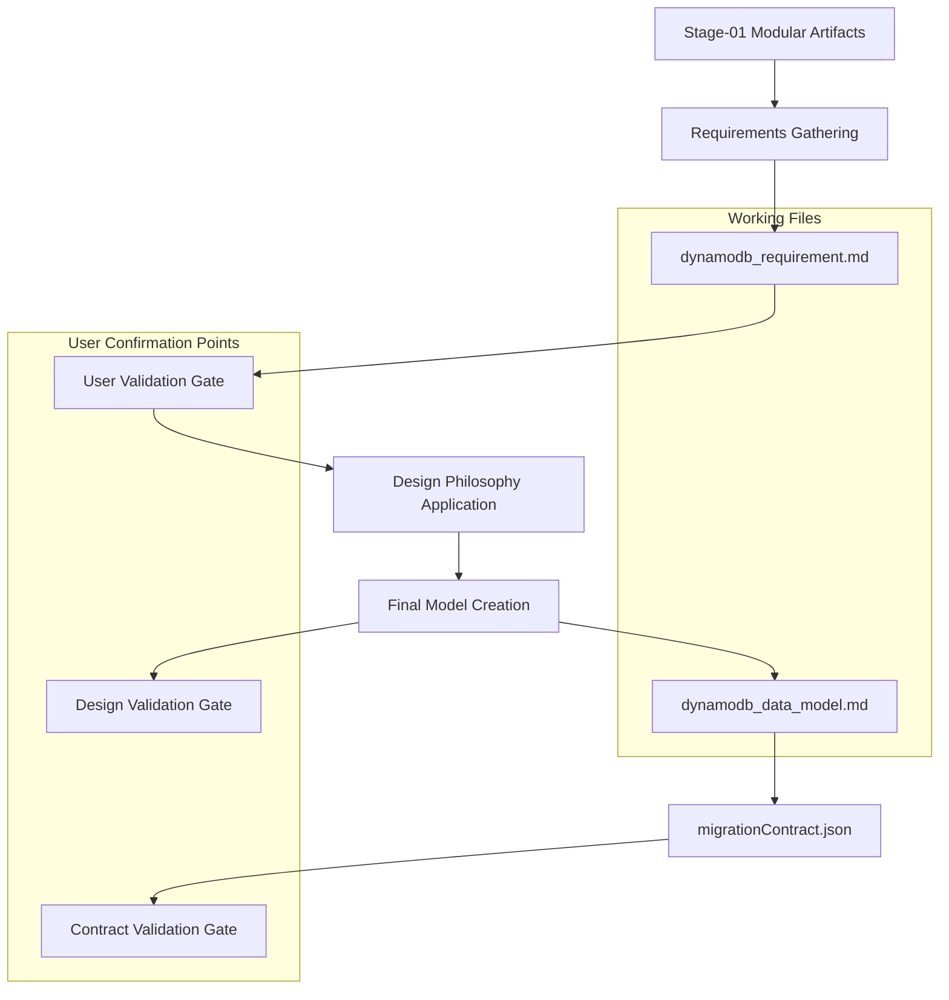

# DynamoDB Data Modeling - Design

## Overview

The DynamoDB Data Modeling stage implements a systematic, user-validated approach to transform MySQL schema analysis into an optimized DynamoDB data model. The design uses a two-file system with explicit user confirmation gates and applies proven DynamoDB design principles with comprehensive trade-off analysis.

## Architecture

### Two-File System Architecture



## Components and Interfaces

### 1. Requirements Documentation System
**Purpose**: Systematic capture and validation of all access pattern requirements
**File**: `dynamodb_requirement.md` (working scratchpad)

**Critical Methodology**:
- **Update Trigger**: After EVERY user message that provides new information
- **RPS Documentation**: EVERY access pattern MUST have RPS documented - never fabricate numbers
- **User Confirmation Gates**: Don't move past requirements until user confirms all patterns captured

**Template Structure**:
```markdown
# DynamoDB Modeling Session

## Application Overview
- **Domain**: [e.g., e-commerce, SaaS, social media]
- **Key Entities**: [list entities and relationships]
- **Business Context**: [critical business rules, constraints]
- **Scale**: [expected users, total requests/second]

## Access Patterns Analysis
| Pattern # | Description | RPS (Peak/Avg) | Type | Attributes | Key Requirements | Design Considerations | Status |
|-----------|-------------|-----------------|------|------------|------------------|----------------------|--------|
| 1 | Get user by ID | 500/200 RPS | Read | userId, name, email | <50ms latency | Simple PK lookup | ✅ |

## Entity Relationships Deep Dive
- **User → Orders**: 1:Many (avg 5 orders per user, max 1000)
- **Order → OrderItems**: 1:Many (avg 3 items per order, max 50)

## Design Considerations (Scratchpad - Subject to Change)
- **Hot Partition Concerns**: User pattern #1 at 500 RPS might need sharding
- **GSI Projections**: Consider KEYS_ONLY for cost optimization
- **Denormalization Ideas**: Maybe duplicate user name in Order table
```

### 2. Design Philosophy Engine
**Purpose**: Apply proven DynamoDB design principles and patterns

**Core Design Philosophy**:
1. **Multi-Table First**: Start with separate tables per entity, not single-table optimization
2. **Natural Keys**: Use descriptive keys (user_id, order_id) not generic ones (PK, SK)
3. **Access Pattern Driven**: Design each table from query patterns, not entity structure
4. **Evidence Before Optimization**: Only denormalize after benchmarks show genuine need

**Denormalization Decision Framework**:
```python
# Critical Evaluation Factors
evaluation_factors = {
    "item_size_trajectory": "Current size and growth rate",
    "access_pattern_coupling": "How tightly entities are accessed together", 
    "write_amplification": "Impact of denormalization on writes",
    "consistency_requirements": "Need for atomic updates across entities",
    "operational_complexity": "Debugging and maintenance overhead",
    "schema_evolution_risk": "Likelihood of structural changes",
    "hot_partition_risk": "Concentration of traffic"
}

# Decision Matrix
def evaluate_denormalization(context):
    if context.early_stage_app or context.cross_service_boundaries:
        return "SEPARATE_TABLES"
    elif context.read_correlation > 0.7 and context.bounded_growth:
        return "CONSIDER_DENORMALIZATION"
    else:
        return "SEPARATE_TABLES"
```

### 3. Final Data Model Generator
**Purpose**: Create comprehensive data model with step-by-step reasoning
**File**: `dynamodb_data_model.md` (final deliverable)

**Critical Methodology**:
- **Step-by-Step Reasoning**: Re-evaluate everything in final model, don't copy design considerations verbatim
- **Complete Justifications**: Every design decision must have detailed reasoning
- **Cost Analysis**: Include RCU/WCU estimates and total cost projections
- **Trade-off Documentation**: Explicit documentation of all trade-offs made

**Template Structure**:
```markdown
# DynamoDB Data Model

## Design Philosophy & Approach
[Explain overall approach and key design principles applied]

## Table Designs
### [TableName] Table
- **Purpose**: [what this table stores and why this design was chosen]
- **Partition Key**: [field] - [detailed justification including distribution reasoning]
- **Sort Key**: [field] - [justification including query patterns enabled]
- **Access Patterns Served**: [Pattern #1, #3, #7]
- **Capacity Planning**: [RPS requirements and provisioning strategy]

### [GSIName] GSI
- **Purpose**: [what access pattern this enables and why GSI was necessary]
- **Partition Key**: [field] - [justification including cardinality and distribution]
- **Projection**: [keys-only/include/all] - [detailed cost vs performance justification]
- **Sparse**: [field] - [specify field used to make GSI sparse and justification]

## Access Pattern Mapping
[Show how each pattern maps to table operations]

## Cost Estimates
[Monthly cost breakdown using average RPS, not peak RPS]

## Hot Partition Analysis
[Analysis of partition distribution and mitigation strategies]
```

### 4. Migration Contract Generator
**Purpose**: Generate exact JSON format for infrastructure and migration automation
**File**: `migrationContract.json`

**CRITICAL: Exact JSON Structure Required**:
```json
[
  {
    "table": "TableName",           // DynamoDB table name
    "type": "Table",                // "Table" or "GSI"
    "source_table": "table_name",   // Primary MySQL source table (cannot be NULL)
    "pk": "PartitionKeyAttribute",  // DynamoDB partition key attribute
    "sk": "SortKeyAttribute",       // DynamoDB sort key attribute (optional)
    "gsis": [                       // Array of GSIs (optional)
      {
        "name": "GSIName",
        "pk": "GSIPartitionKey",
        "sk": "GSISortKey"          // Optional
      }
    ],
    "attributes": {                 // Map of DynamoDB attributes
      "AttributeName": {
        "type": "S",                // DynamoDB type: S (string), N (number), B (binary)
        "source_table": "table_name", // MySQL source table
        "source_column": "column_name", // MySQL source column
        "denormalized": true,       // Optional, indicates if denormalized data
        "justification": "Reason for denormalization", // Required if denormalized is true
        "join": {                   // Required if denormalized is true
          "local_column": "column_name", // Join column in primary source table
          "source_column": "column_name" // Join column in denormalized source table
        }
      }
    },
    "satisfies": ["access pattern description"], // Access patterns this table/GSI satisfies
    "estimated_item_size_bytes": 100 // Estimated size of items in this table
  }
]
```

## Data Models

### Access Pattern Documentation
```python
@dataclass
class AccessPattern:
    pattern_id: str
    description: str
    rps_peak: float
    rps_average: float
    operation_type: str  # READ, WRITE, UPDATE, DELETE
    entities_involved: List[str]
    consistency_requirements: str  # EVENTUAL, STRONG
    complexity: str  # SIMPLE, MODERATE, COMPLEX
    dynamodb_suitability: str  # HIGH, MEDIUM, LOW
```

### Design Decision Framework
```python
@dataclass
class DesignDecision:
    decision_type: str  # TABLE_STRUCTURE, GSI_DESIGN, DENORMALIZATION
    alternatives_considered: List[str]
    chosen_approach: str
    justification: str
    trade_offs: List[str]
    rollback_strategy: str
    monitoring_requirements: List[str]
```

## Error Handling

### User Validation Gates
- **Requirements Gate**: User must explicitly confirm all access patterns are captured
- **Design Gate**: User must approve data model before contract generation
- **Contract Gate**: User must validate migration contract format and completeness

### Quality Assurance
- Verify every access pattern has RPS estimates (no fabricated numbers)
- Ensure all design decisions have explicit justifications
- Validate migration contract follows exact JSON structure
- Confirm all MySQL entities are mapped to DynamoDB structures

## Critical Production Warnings

The system must prominently surface these warnings when relevant:

1. **GSI Throttling Cascade**: "Warning: GSI throttling will affect the entire base table. Consider dedicated capacity or alternative design."
2. **Hot Partition Risk**: "Warning: This access pattern may create hot partitions. Consider partition key sharding strategy."
3. **Entity Boundary Violation**: "Warning: Mixing data from different services/teams. Consider operational ownership boundaries."
4. **Schema Evolution Trap**: "Warning: This denormalization will complicate future schema changes. Document migration strategy."
5. **Debugging Complexity**: "Warning: Composite keys and denormalized data will increase debugging difficulty. Ensure adequate logging/monitoring."

## Unique Constraint Handling

For each unique attribute from MySQL:
1. Create dedicated lookup table (attribute as PK)
2. Use TransactWriteItems for atomic operations
3. Include ConditionExpression for uniqueness

Example Implementation:
```json
"ddb_query_plan": {
  "TransactWriteItems": [
    {
      "PutItem": {
        "Table": "Books",
        "Item": {
          "BookId": "$generated_id",
          "ISBN": "$isbn",
          "Title": "$title"
        }
      }
    },
    {
      "PutItem": {
        "Table": "ISBNs",
        "Item": {
          "ISBN": "$isbn",
          "BookId": "$generated_id"
        },
        "ConditionExpression": "attribute_not_exists(ISBN)"
      }
    }
  ]
}
```