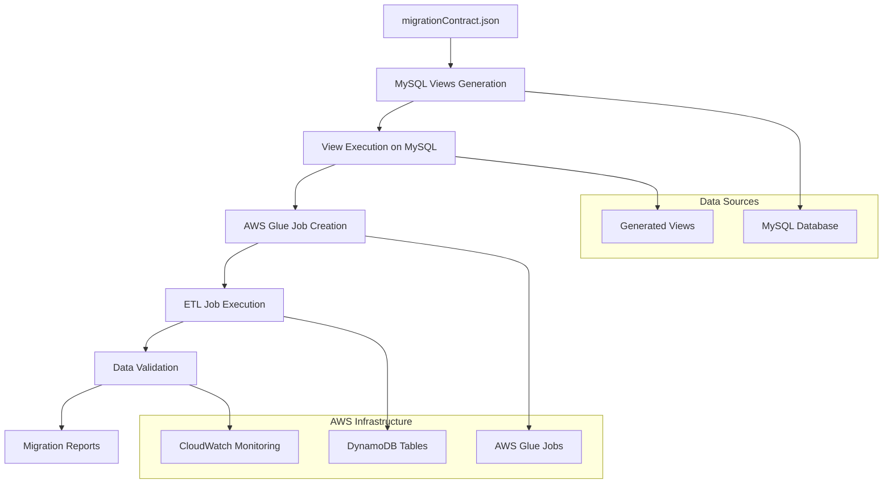

# Data Migration Execution - Design

## Overview

The Data Migration Execution stage implements a safe, monitored data migration process using MySQL views for data transformation and AWS Glue ETL jobs for data transfer. The design emphasizes data integrity, comprehensive validation, and detailed monitoring throughout the migration process.

## Architecture

### Migration Execution Architecture



## Components and Interfaces

### 1. MySQL Views Generation System
**Purpose**: Transform MySQL data structure to match DynamoDB requirements

**View Generation Process**:
```python
class MySQLViewGenerator:
    def __init__(self, migration_contract: MigrationContract):
        self.contract = migration_contract
        self.generated_views = []
    
    def generate_views_for_all_tables(self) -> str:
        """Generate MySQL views for each DynamoDB table in the migration contract"""
        sql_statements = []
        
        for table_config in self.contract:
            if table_config['type'] == 'Table':
                view_sql = self.generate_view_for_table(table_config)
                sql_statements.append(view_sql)
                self.generated_views.append({
                    'table_name': table_config['table'],
                    'view_name': f"migration_view_{table_config['table']}",
                    'source_table': table_config['source_table']
                })
        
        return '\n\n'.join(sql_statements)
    
    def generate_view_for_table(self, table_config: dict) -> str:
        """Generate SQL view for a specific DynamoDB table"""
        view_name = f"migration_view_{table_config['table']}"
        source_table = table_config['source_table']
        
        # Build SELECT clause with attribute mappings
        select_clauses = []
        join_clauses = []
        
        for attr_name, attr_config in table_config['attributes'].items():
            if attr_config.get('denormalized', False):
                # Handle denormalized attributes with joins
                join_info = attr_config['join']
                join_table = attr_config['source_table']
                
                select_clauses.append(
                    f"{join_table}.{attr_config['source_column']} AS {attr_name}"
                )
                
                join_clauses.append(
                    f"LEFT JOIN {join_table} ON {source_table}.{join_info['local_column']} = {join_table}.{join_info['source_column']}"
                )
            else:
                # Handle regular attributes
                select_clauses.append(
                    f"{source_table}.{attr_config['source_column']} AS {attr_name}"
                )
        
        # Construct the complete SQL view
        sql = f"""
CREATE OR REPLACE VIEW {view_name} AS
SELECT 
    {', '.join(select_clauses)}
FROM {source_table}
{' '.join(join_clauses)}
WHERE {source_table}.deleted_at IS NULL  -- Exclude soft-deleted records
ORDER BY {source_table}.id;
"""
        
        return sql.strip()
```

### 2. AWS Glue ETL Job Management System
**Purpose**: Create and execute ETL jobs for data migration

**Glue Job Configuration**:
```python
class GlueJobManager:
    def __init__(self, region: str, migration_contract: MigrationContract):
        self.glue_client = boto3.client('glue', region_name=region)
        self.region = region
        self.contract = migration_contract
    
    def create_migration_jobs(self, view_names: List[str]) -> List[str]:
        """Create AWS Glue jobs for each migration view"""
        job_names = []
        
        for i, table_config in enumerate(self.contract):
            if table_config['type'] == 'Table':
                job_name = f"mysql-to-dynamodb-{table_config['table']}"
                view_name = view_names[i]
                
                job_definition = self.create_job_definition(
                    job_name, 
                    table_config, 
                    view_name
                )
                
                self.glue_client.create_job(**job_definition)
                job_names.append(job_name)
        
        return job_names
    
    def create_job_definition(self, job_name: str, table_config: dict, view_name: str) -> dict:
        """Create Glue job definition for a specific table migration"""
        return {
            'Name': job_name,
            'Role': 'arn:aws:iam::ACCOUNT:role/GlueServiceRole',  # User must provide
            'Command': {
                'Name': 'glueetl',
                'ScriptLocation': f's3://migration-scripts/{job_name}.py',
                'PythonVersion': '3'
            },
            'DefaultArguments': {
                '--job-bookmark-option': 'job-bookmark-enable',
                '--enable-metrics': 'true',
                '--enable-continuous-cloudwatch-log': 'true',
                '--mysql-view-name': view_name,
                '--dynamodb-table-name': table_config['table'],
                '--region': self.region,
                '--migration-contract': json.dumps(table_config)
            },
            'MaxRetries': 3,
            'Timeout': 2880,  # 48 hours
            'GlueVersion': '3.0',
            'NumberOfWorkers': 10,
            'WorkerType': 'G.1X',
            'Tags': {
                'Project': 'MySQL-DynamoDB-Migration',
                'Table': table_config['table'],
                'Environment': 'Migration'
            }
        }
    
    def execute_migration_jobs(self, job_names: List[str]) -> List[str]:
        """Execute all migration jobs and return job run IDs"""
        job_run_ids = []
        
        for job_name in job_names:
            response = self.glue_client.start_job_run(
                JobName=job_name,
                Arguments={
                    '--migration-timestamp': datetime.now().isoformat()
                }
            )
            job_run_ids.append(response['JobRunId'])
        
        return job_run_ids
```

### 3. Data Validation and Integrity System
**Purpose**: Ensure data integrity throughout the migration process

**Validation Framework**:
```python
class MigrationValidator:
    def __init__(self, mysql_connection, dynamodb_client, migration_contract):
        self.mysql = mysql_connection
        self.dynamodb = dynamodb_client
        self.contract = migration_contract
    
    def validate_migration_completeness(self) -> ValidationReport:
        """Validate that all data has been successfully migrated"""
        report = ValidationReport()
        
        for table_config in self.contract:
            if table_config['type'] == 'Table':
                table_validation = self.validate_table_migration(table_config)
                report.add_table_validation(table_validation)
        
        return report
    
    def validate_table_migration(self, table_config: dict) -> TableValidationResult:
        """Validate migration for a specific table"""
        source_table = table_config['source_table']
        target_table = table_config['table']
        
        # Count records in source
        mysql_count = self.count_mysql_records(source_table)
        
        # Count records in DynamoDB
        dynamodb_count = self.count_dynamodb_records(target_table)
        
        # Sample data validation
        sample_validation = self.validate_sample_data(table_config)
        
        return TableValidationResult(
            table_name=target_table,
            source_count=mysql_count,
            target_count=dynamodb_count,
            count_match=mysql_count == dynamodb_count,
            sample_validation=sample_validation,
            data_integrity_score=self.calculate_integrity_score(sample_validation)
        )
    
    def validate_sample_data(self, table_config: dict, sample_size: int = 100) -> SampleValidationResult:
        """Validate a sample of migrated data for accuracy"""
        source_table = table_config['source_table']
        target_table = table_config['table']
        
        # Get sample records from MySQL
        mysql_sample = self.get_mysql_sample(source_table, sample_size)
        
        validation_results = []
        
        for mysql_record in mysql_sample:
            # Get corresponding DynamoDB record
            pk_value = mysql_record[table_config['pk']]
            dynamodb_record = self.get_dynamodb_record(target_table, pk_value)
            
            if dynamodb_record:
                comparison = self.compare_records(mysql_record, dynamodb_record, table_config)
                validation_results.append(comparison)
            else:
                validation_results.append(RecordComparison(
                    mysql_id=pk_value,
                    found_in_dynamodb=False,
                    differences=['Record not found in DynamoDB']
                ))
        
        return SampleValidationResult(
            total_sampled=len(mysql_sample),
            successful_matches=len([r for r in validation_results if r.is_match]),
            validation_results=validation_results
        )
    
    def compare_records(self, mysql_record: dict, dynamodb_record: dict, table_config: dict) -> RecordComparison:
        """Compare individual records between MySQL and DynamoDB"""
        differences = []
        
        for attr_name, attr_config in table_config['attributes'].items():
            mysql_value = mysql_record.get(attr_config['source_column'])
            dynamodb_value = dynamodb_record.get(attr_name)
            
            # Handle type conversions and formatting
            if not self.values_match(mysql_value, dynamodb_value, attr_config['type']):
                differences.append(f"{attr_name}: MySQL={mysql_value}, DynamoDB={dynamodb_value}")
        
        return RecordComparison(
            mysql_id=mysql_record[table_config['pk']],
            found_in_dynamodb=True,
            is_match=len(differences) == 0,
            differences=differences
        )
```

### 4. Monitoring and Reporting System
**Purpose**: Provide comprehensive monitoring and reporting throughout migration

**Monitoring Implementation**:
```python
class MigrationMonitor:
    def __init__(self, cloudwatch_client, glue_client):
        self.cloudwatch = cloudwatch_client
        self.glue = glue_client
        self.metrics = []
    
    def monitor_job_progress(self, job_run_ids: List[str]) -> MigrationProgress:
        """Monitor progress of all migration jobs"""
        progress = MigrationProgress()
        
        for job_run_id in job_run_ids:
            job_status = self.get_job_status(job_run_id)
            progress.add_job_status(job_status)
            
            if job_status.state in ['FAILED', 'ERROR']:
                error_details = self.get_job_error_details(job_run_id)
                progress.add_error(error_details)
        
        return progress
    
    def generate_migration_report(self, validation_report: ValidationReport, job_statuses: List[JobStatus]) -> MigrationReport:
        """Generate comprehensive migration completion report"""
        return MigrationReport(
            migration_timestamp=datetime.now(),
            total_tables_migrated=len([s for s in job_statuses if s.state == 'SUCCEEDED']),
            total_records_migrated=sum(v.target_count for v in validation_report.table_validations),
            data_integrity_score=validation_report.overall_integrity_score,
            job_execution_summary=job_statuses,
            validation_summary=validation_report,
            recommendations=self.generate_recommendations(validation_report, job_statuses)
        )
    
    def publish_metrics(self, metric_name: str, value: float, unit: str = 'Count'):
        """Publish custom metrics to CloudWatch"""
        self.cloudwatch.put_metric_data(
            Namespace='MySQL-DynamoDB-Migration',
            MetricData=[
                {
                    'MetricName': metric_name,
                    'Value': value,
                    'Unit': unit,
                    'Timestamp': datetime.now()
                }
            ]
        )
```

## Data Models

### Migration Contract Reference
```python
@dataclass
class MigrationContractEntry:
    table: str
    type: str  # 'Table' or 'GSI'
    source_table: str
    pk: str
    sk: Optional[str]
    gsis: Optional[List[GSIDefinition]]
    attributes: Dict[str, AttributeDefinition]
    satisfies: List[str]
    estimated_item_size_bytes: int
```

### Validation Results
```python
@dataclass
class ValidationReport:
    migration_timestamp: datetime
    table_validations: List[TableValidationResult]
    overall_integrity_score: float
    total_records_validated: int
    issues_found: List[str]
    recommendations: List[str]

@dataclass
class TableValidationResult:
    table_name: str
    source_count: int
    target_count: int
    count_match: bool
    sample_validation: SampleValidationResult
    data_integrity_score: float
```

### Migration Progress Tracking
```python
@dataclass
class MigrationProgress:
    total_jobs: int
    completed_jobs: int
    failed_jobs: int
    in_progress_jobs: int
    job_statuses: List[JobStatus]
    errors: List[ErrorDetails]
    estimated_completion_time: Optional[datetime]
```

## Error Handling

### MySQL View Generation Errors
- Invalid migration contract format
- Missing source tables or columns
- SQL syntax errors in generated views
- Database connectivity issues

### AWS Glue Job Errors
- Insufficient IAM permissions
- Resource allocation failures
- Data transformation errors
- Network connectivity issues

### Data Validation Errors
- Record count mismatches
- Data type conversion failures
- Missing or corrupted records
- Performance issues with large datasets

### Recovery Procedures
- Automatic retry mechanisms for transient failures
- Partial migration recovery and resumption
- Data rollback procedures for critical failures
- Manual intervention procedures for complex issues

## Security and Compliance

### Data Protection
- Encryption in transit for all data transfers
- Secure credential management for database connections
- Audit logging for all migration activities
- Data masking for sensitive information during validation

### Access Control
- Least privilege access for all migration components
- Separate roles for different migration phases
- Network isolation for migration infrastructure
- Comprehensive access logging and monitoring

### Compliance Considerations
- Data residency requirements for cross-region migrations
- Audit trail maintenance for compliance reporting
- Data retention policies for migration artifacts
- Privacy protection during data transformation

## Performance Optimization

### Parallel Processing
- Concurrent execution of multiple Glue jobs
- Parallel data validation processes
- Batch processing for large datasets
- Resource optimization for cost efficiency

### Memory and Storage Management
- Efficient memory usage in ETL processes
- Temporary storage management for large datasets
- Cleanup procedures for intermediate data
- Resource monitoring and optimization

### Network Optimization
- VPC endpoints for AWS service communication
- Connection pooling for database connections
- Bandwidth optimization for large data transfers
- Regional placement for optimal performance