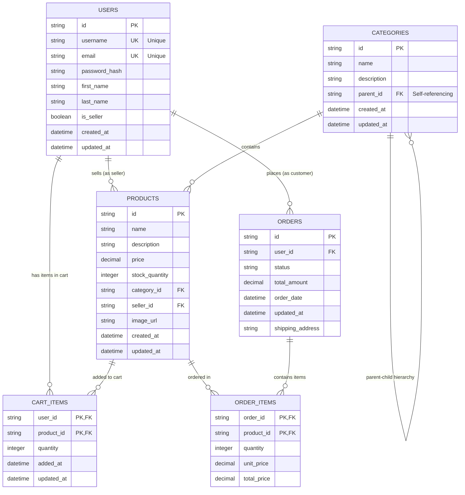

# Entity Relationship Diagram - Modernizer E-commerce Platform

This diagram shows the entity relationships for the DynamoDB design based on the API access patterns analysis.

## Key Relationship Notes:

### **One-to-Many Relationships:**
- **Users → Products**: A seller (user) can have many products
- **Users → Orders**: A customer (user) can have many orders  
- **Users → Cart Items**: A user can have many items in their cart
- **Categories → Products**: A category can contain many products
- **Products → Order Items**: A product can appear in many order items
- **Products → Cart Items**: A product can be in many users' carts
- **Orders → Order Items**: An order can contain many order items

### **Self-Referencing Relationship:**
- **Categories → Categories**: Categories form a hierarchical tree structure where each category can have a parent category

### **Composite Primary Keys:**
- **Order Items**: `(order_id, product_id)` - Links orders to products with quantities
- **Cart Items**: `(user_id, product_id)` - Links users to products in their shopping cart

### **Unique Constraints:**
- **Users**: `username` and `email` must be unique across all users

This entity model supports all 48 access patterns identified in the API analysis, including:
- User authentication and profile management
- Product catalog browsing and management
- Category hierarchy navigation
- Order processing and history
- Shopping cart operations
- Seller-specific functionality

The relationships enable efficient querying for complex operations like:
- Product searches with category filtering
- User order history with item details
- Seller product management
- Cart validation and checkout processing
- Category breadcrumb navigation
