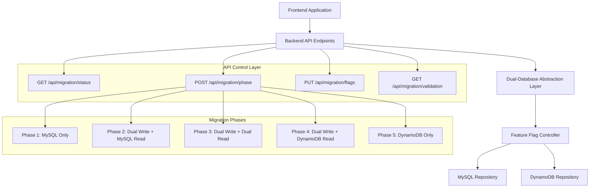

# Feature Flags API System - Design

## Overview

The Feature Flags API System provides backend REST endpoints to control the dual-database feature flags implemented in stages 03-04. The design enables safe, controlled transition from MySQL to DynamoDB through 5 distinct migration phases via simple API calls, keeping the frontend completely transparent to the migration process.

## Architecture

### API-Controlled Migration Architecture



### 5 Migration Phases

1. **Phase 1 - MySQL Only**: Write to MySQL, Read from MySQL (baseline)
2. **Phase 2 - Dual Write + MySQL Read**: Write to both, Read from MySQL (safety phase)
3. **Phase 3 - Dual Write + Dual Read**: Write to both, Read from both with validation (validation phase)
4. **Phase 4 - Dual Write + DynamoDB Read**: Write to both, Read from DynamoDB (transition phase)
5. **Phase 5 - DynamoDB Only**: Write to DynamoDB, Read from DynamoDB (final state)

## Components and Interfaces

### 1. Feature Flag API Controller
**Purpose**: Provide REST endpoints to control the dual-database feature flags from stages 03-04

**Critical Methodology**:
- **Backend API Control**: Feature flags controlled via REST endpoints, not frontend cookies
- **Existing Infrastructure**: Uses the dual-database abstraction layer already implemented in stages 03-04
- **No Mock Testing**: Use real databases, no mock tests or mock data
- **Test Gates**: Run tests before changes and after each substantive change

**API Endpoints Structure**:
```typescript
interface MigrationFlags {
    READ_MYSQL: boolean;
    READ_DDB: boolean;
    WRITE_MYSQL: boolean;
    WRITE_DDB: boolean;
}

interface MigrationPhase {
    phase: 1 | 2 | 3 | 4 | 5;
    name: string;
    description: string;
    flags: MigrationFlags;
}

class MigrationController {
    constructor(
        private dualDatabaseFactory: DualDatabaseRepositoryFactory, // From stage 03-04
        private logger: Logger
    ) {}
    
    // GET /api/migration/status
    async getStatus(req: Request, res: Response): Promise<void> {
        try {
            const currentFlags = this.dualDatabaseFactory.getCurrentFlags();
            const currentPhase = this.determinePhaseFromFlags(currentFlags);
            
            res.json({
                currentPhase,
                flags: currentFlags,
                timestamp: new Date().toISOString()
            });
        } catch (error) {
            this.logger.error('Failed to get migration status', error);
            res.status(500).json({ error: 'Failed to get migration status' });
        }
    }
    
    // POST /api/migration/phase
    async setPhase(req: Request, res: Response): Promise<void> {
        try {
            const { phase } = req.body;
            const phaseConfig = this.getPhaseConfiguration(phase);
            
            await this.dualDatabaseFactory.updateFeatureFlags(phaseConfig.flags);
            
            this.logger.info('Migration phase updated', { phase, flags: phaseConfig.flags });
            
            res.json({
                success: true,
                phase: phaseConfig,
                timestamp: new Date().toISOString()
            });
        } catch (error) {
            this.logger.error('Failed to set migration phase', error);
            res.status(500).json({ error: 'Failed to set migration phase' });
        }
    }
    
    // PUT /api/migration/flags
    async updateFlags(req: Request, res: Response): Promise<void> {
        try {
            const flags: MigrationFlags = req.body;
            
            await this.dualDatabaseFactory.updateFeatureFlags(flags);
            
            this.logger.info('Feature flags updated', { flags });
            
            res.json({
                success: true,
                flags,
                timestamp: new Date().toISOString()
            });
        } catch (error) {
            this.logger.error('Failed to update feature flags', error);
            res.status(500).json({ error: 'Failed to update feature flags' });
        }
    }
}
```

### 2. Migration Phase Configuration System
**Purpose**: Define and manage the 5 migration phases with their corresponding feature flag configurations

**Phase Configuration**:
```typescript
const MIGRATION_PHASES: Record<number, MigrationPhase> = {
    1: {
        phase: 1,
        name: "MySQL Only",
        description: "Baseline state - all operations use MySQL",
        flags: {
            READ_MYSQL: true,
            READ_DDB: false,
            WRITE_MYSQL: true,
            WRITE_DDB: false
        }
    },
    2: {
        phase: 2,
        name: "Dual Write + MySQL Read",
        description: "Safety phase - write to both databases, read from MySQL",
        flags: {
            READ_MYSQL: true,
            READ_DDB: false,
            WRITE_MYSQL: true,
            WRITE_DDB: true
        }
    },
    3: {
        phase: 3,
        name: "Dual Write + Dual Read",
        description: "Validation phase - write to both, read from both with validation",
        flags: {
            READ_MYSQL: true,
            READ_DDB: true,
            WRITE_MYSQL: true,
            WRITE_DDB: true
        }
    },
    4: {
        phase: 4,
        name: "Dual Write + DynamoDB Read",
        description: "Transition phase - write to both, read from DynamoDB",
        flags: {
            READ_MYSQL: false,
            READ_DDB: true,
            WRITE_MYSQL: true,
            WRITE_DDB: true
        }
    },
    5: {
        phase: 5,
        name: "DynamoDB Only",
        description: "Final state - all operations use DynamoDB",
        flags: {
            READ_MYSQL: false,
            READ_DDB: true,
            WRITE_MYSQL: false,
            WRITE_DDB: true
        }
    }
};

class MigrationPhaseManager {
    getPhaseConfiguration(phase: number): MigrationPhase {
        const config = MIGRATION_PHASES[phase];
        if (!config) {
            throw new Error(`Invalid migration phase: ${phase}`);
        }
        return config;
    }
    
    determinePhaseFromFlags(flags: MigrationFlags): MigrationPhase {
        for (const [phaseNum, config] of Object.entries(MIGRATION_PHASES)) {
            if (this.flagsMatch(flags, config.flags)) {
                return config;
            }
        }
        
        // Return custom configuration if no standard phase matches
        return {
            phase: 0,
            name: "Custom Configuration",
            description: "Custom feature flag configuration",
            flags
        };
    }
    
    private flagsMatch(flags1: MigrationFlags, flags2: MigrationFlags): boolean {
        return flags1.READ_MYSQL === flags2.READ_MYSQL &&
               flags1.READ_DDB === flags2.READ_DDB &&
               flags1.WRITE_MYSQL === flags2.WRITE_MYSQL &&
               flags1.WRITE_DDB === flags2.WRITE_DDB;
    }
}
```

### 3. Validation and Monitoring API System
**Purpose**: Provide API endpoints to monitor dual-read validation and system health

**Validation API Endpoints**:
```typescript
class ValidationController {
    constructor(
        private dualDatabaseFactory: DualDatabaseRepositoryFactory,
        private validationLogger: ValidationLogger,
        private logger: Logger
    ) {}
    
    // GET /api/migration/validation/status
    async getValidationStatus(req: Request, res: Response): Promise<void> {
        try {
            const validationStats = await this.validationLogger.getValidationStats();
            
            res.json({
                validationEnabled: this.isValidationEnabled(),
                stats: validationStats,
                timestamp: new Date().toISOString()
            });
        } catch (error) {
            this.logger.error('Failed to get validation status', error);
            res.status(500).json({ error: 'Failed to get validation status' });
        }
    }
    
    // GET /api/migration/validation/errors
    async getValidationErrors(req: Request, res: Response): Promise<void> {
        try {
            const { limit = 50, offset = 0 } = req.query;
            const errors = await this.validationLogger.getValidationErrors(
                parseInt(limit as string),
                parseInt(offset as string)
            );
            
            res.json({
                errors,
                total: errors.length,
                timestamp: new Date().toISOString()
            });
        } catch (error) {
            this.logger.error('Failed to get validation errors', error);
            res.status(500).json({ error: 'Failed to get validation errors' });
        }
    }
    
    // POST /api/migration/validation/enable
    async enableValidation(req: Request, res: Response): Promise<void> {
        try {
            await this.dualDatabaseFactory.enableValidation();
            
            this.logger.info('Dual-read validation enabled');
            
            res.json({
                success: true,
                validationEnabled: true,
                timestamp: new Date().toISOString()
            });
        } catch (error) {
            this.logger.error('Failed to enable validation', error);
            res.status(500).json({ error: 'Failed to enable validation' });
        }
    }
    
    // POST /api/migration/validation/disable
    async disableValidation(req: Request, res: Response): Promise<void> {
        try {
            await this.dualDatabaseFactory.disableValidation();
            
            this.logger.info('Dual-read validation disabled');
            
            res.json({
                success: true,
                validationEnabled: false,
                timestamp: new Date().toISOString()
            });
        } catch (error) {
            this.logger.error('Failed to disable validation', error);
            res.status(500).json({ error: 'Failed to disable validation' });
        }
    }
    
    private isValidationEnabled(): boolean {
        const flags = this.dualDatabaseFactory.getCurrentFlags();
        return flags.READ_MYSQL && flags.READ_DDB; // Validation only possible in dual-read mode
    }
}

interface ValidationStats {
    totalValidations: number;
    successfulValidations: number;
    failedValidations: number;
    errorRate: number;
    lastValidationTime: Date;
}

interface ValidationError {
    id: string;
    timestamp: Date;
    operation: string;
    entityType: string;
    differences: string[];
    mysqlData: any;
    dynamoData: any;
}
```

### 4. Frontend Transparency System
**Purpose**: Ensure frontend remains completely unaware of the migration process

**Critical Methodology**:
- **No Frontend Changes**: Frontend code remains completely unchanged during migration
- **API Transparency**: All existing API endpoints continue to work exactly as before
- **Response Consistency**: API responses maintain the same format regardless of underlying database
- **Error Handling**: Database-specific errors are handled in the backend and presented consistently

**Frontend Transparency Implementation**:
```typescript
// Frontend continues to make normal API calls
// Example: User management API calls remain unchanged

// Frontend code (UNCHANGED):
const createUser = async (userData) => {
    const response = await fetch('/api/users', {
        method: 'POST',
        headers: { 'Content-Type': 'application/json' },
        body: JSON.stringify(userData)
    });
    return response.json();
};

const getUser = async (userId) => {
    const response = await fetch(`/api/users/${userId}`);
    return response.json();
};

// Backend handles routing based on feature flags (TRANSPARENT TO FRONTEND):
class UserController {
    constructor(private userRepository: IUserRepository) {} // Uses dual-database repository
    
    async createUser(req: Request, res: Response): Promise<void> {
        try {
            // Repository automatically handles MySQL/DynamoDB routing based on feature flags
            const user = await this.userRepository.create(req.body);
            
            // Response format stays exactly the same regardless of database used
            res.json({
                success: true,
                user: {
                    id: user.id,
                    email: user.email,
                    name: user.name,
                    createdAt: user.createdAt
                }
            });
        } catch (error) {
            // Error handling stays consistent regardless of database
            res.status(500).json({
                success: false,
                error: 'Failed to create user'
            });
        }
    }
    
    async getUser(req: Request, res: Response): Promise<void> {
        try {
            // Repository automatically handles MySQL/DynamoDB routing based on feature flags
            const user = await this.userRepository.findById(req.params.id);
            
            if (!user) {
                return res.status(404).json({
                    success: false,
                    error: 'User not found'
                });
            }
            
            // Response format stays exactly the same regardless of database used
            res.json({
                success: true,
                user: {
                    id: user.id,
                    email: user.email,
                    name: user.name,
                    createdAt: user.createdAt
                }
            });
        } catch (error) {
            // Error handling stays consistent regardless of database
            res.status(500).json({
                success: false,
                error: 'Failed to get user'
            });
        }
    }
}
```

## Data Models

### API Request/Response Models
```typescript
// GET /api/migration/status response
interface MigrationStatusResponse {
    currentPhase: MigrationPhase;
    flags: MigrationFlags;
    timestamp: string;
}

// POST /api/migration/phase request
interface SetPhaseRequest {
    phase: 1 | 2 | 3 | 4 | 5;
}

// POST /api/migration/phase response
interface SetPhaseResponse {
    success: boolean;
    phase: MigrationPhase;
    timestamp: string;
}

// PUT /api/migration/flags request
interface UpdateFlagsRequest {
    READ_MYSQL: boolean;
    READ_DDB: boolean;
    WRITE_MYSQL: boolean;
    WRITE_DDB: boolean;
}

// PUT /api/migration/flags response
interface UpdateFlagsResponse {
    success: boolean;
    flags: MigrationFlags;
    timestamp: string;
}

// GET /api/migration/validation/status response
interface ValidationStatusResponse {
    validationEnabled: boolean;
    stats: ValidationStats;
    timestamp: string;
}

// GET /api/migration/validation/errors response
interface ValidationErrorsResponse {
    errors: ValidationError[];
    total: number;
    timestamp: string;
}
```

### Migration Phase Model
```typescript
interface MigrationPhase {
    phase: 0 | 1 | 2 | 3 | 4 | 5; // 0 = custom configuration
    name: string;
    description: string;
    flags: MigrationFlags;
}

interface MigrationFlags {
    READ_MYSQL: boolean;
    READ_DDB: boolean;
    WRITE_MYSQL: boolean;
    WRITE_DDB: boolean;
}
```

### Validation Models
```typescript
interface ValidationStats {
    totalValidations: number;
    successfulValidations: number;
    failedValidations: number;
    errorRate: number;
    lastValidationTime: Date;
}

interface ValidationError {
    id: string;
    timestamp: Date;
    operation: string;
    entityType: string;
    differences: string[];
    mysqlData: any;
    dynamoData: any;
}
```

## Error Handling

### Dual-Write Error Handling
- MySQL write failures: Fail the entire operation
- DynamoDB write failures: Log error but continue with MySQL result
- Configuration errors: Provide clear error messages
- Network failures: Implement retry logic with exponential backoff

### Dual-Read Error Handling
- Validation failures: Log detailed differences and raise clear errors
- Database connectivity issues: Fallback to single database read
- Data inconsistencies: Provide detailed comparison reports
- Performance issues: Implement timeout handling

### Web Interface Error Handling
- Form validation errors: Provide inline error messages
- Cookie setting failures: Fallback to default configuration
- Server communication errors: Provide user-friendly error messages
- Browser compatibility issues: Graceful degradation

### 5. Super Admin Frontend Interface
**Purpose**: Provide a secure, hidden frontend page for super administrators to control migration API endpoints

**Critical Methodology**:
- **Super Admin Only**: Restrict access to users with super admin privileges
- **Hidden Interface**: Not accessible through normal navigation, requires direct URL access
- **Real-time Updates**: Display live migration status and validation data
- **Existing Patterns**: Follow existing frontend architecture and styling

**Frontend Admin Interface Structure**:
```typescript
// Super Admin Migration Control Page Component
interface MigrationControlPageProps {
    user: User; // Must have superAdmin: true
}

interface MigrationControlState {
    currentPhase: MigrationPhase;
    flags: MigrationFlags;
    validationStatus: ValidationStatusResponse;
    validationErrors: ValidationError[];
    loading: boolean;
    error: string | null;
}

class MigrationControlPage extends React.Component<MigrationControlPageProps, MigrationControlState> {
    constructor(props: MigrationControlPageProps) {
        super(props);
        this.state = {
            currentPhase: null,
            flags: null,
            validationStatus: null,
            validationErrors: [],
            loading: true,
            error: null
        };
    }
    
    async componentDidMount() {
        // Verify super admin access
        if (!this.props.user.super_admin) {
            this.setState({ error: 'Access denied: Super admin privileges required' });
            return;
        }
        
        await this.loadMigrationStatus();
        await this.loadValidationStatus();
        
        // Set up real-time updates every 30 seconds
        this.statusInterval = setInterval(() => {
            this.loadMigrationStatus();
            this.loadValidationStatus();
        }, 30000);
    }
    
    async loadMigrationStatus() {
        try {
            const response = await fetch('/api/migration/status');
            const data = await response.json();
            
            this.setState({
                currentPhase: data.currentPhase,
                flags: data.flags,
                loading: false
            });
        } catch (error) {
            this.setState({ error: 'Failed to load migration status', loading: false });
        }
    }
    
    async setMigrationPhase(phase: number) {
        try {
            this.setState({ loading: true });
            
            const response = await fetch('/api/migration/phase', {
                method: 'POST',
                headers: { 'Content-Type': 'application/json' },
                body: JSON.stringify({ phase })
            });
            
            if (response.ok) {
                await this.loadMigrationStatus();
                this.showSuccessMessage(`Successfully switched to Phase ${phase}`);
            } else {
                throw new Error('Failed to set migration phase');
            }
        } catch (error) {
            this.setState({ error: 'Failed to set migration phase', loading: false });
        }
    }
    
    async updateFeatureFlags(flags: MigrationFlags) {
        try {
            this.setState({ loading: true });
            
            const response = await fetch('/api/migration/flags', {
                method: 'PUT',
                headers: { 'Content-Type': 'application/json' },
                body: JSON.stringify(flags)
            });
            
            if (response.ok) {
                await this.loadMigrationStatus();
                this.showSuccessMessage('Feature flags updated successfully');
            } else {
                throw new Error('Failed to update feature flags');
            }
        } catch (error) {
            this.setState({ error: 'Failed to update feature flags', loading: false });
        }
    }
    
    render() {
        const { currentPhase, flags, validationStatus, loading, error } = this.state;
        
        if (error && error.includes('Access denied')) {
            return (
                <div className="error-page">
                    <h1>Access Denied</h1>
                    <p>Super administrator privileges required to access this page.</p>
                </div>
            );
        }
        
        return (
            <div className="migration-control-page">
                <h1>Database Migration Control Panel</h1>
                <p className="warning-text">
                    ⚠️ Super Admin Only - This interface controls live database migration settings
                </p>
                
                {/* Current Status Section */}
                <section className="status-section">
                    <h2>Current Migration Status</h2>
                    {currentPhase && (
                        <div className="status-card">
                            <h3>Phase {currentPhase.phase}: {currentPhase.name}</h3>
                            <p>{currentPhase.description}</p>
                            <div className="flags-display">
                                <span className={flags?.READ_MYSQL ? 'flag-enabled' : 'flag-disabled'}>
                                    MySQL Read: {flags?.READ_MYSQL ? 'ON' : 'OFF'}
                                </span>
                                <span className={flags?.READ_DDB ? 'flag-enabled' : 'flag-disabled'}>
                                    DynamoDB Read: {flags?.READ_DDB ? 'ON' : 'OFF'}
                                </span>
                                <span className={flags?.WRITE_MYSQL ? 'flag-enabled' : 'flag-disabled'}>
                                    MySQL Write: {flags?.WRITE_MYSQL ? 'ON' : 'OFF'}
                                </span>
                                <span className={flags?.WRITE_DDB ? 'flag-enabled' : 'flag-disabled'}>
                                    DynamoDB Write: {flags?.WRITE_DDB ? 'ON' : 'OFF'}
                                </span>
                            </div>
                        </div>
                    )}
                </section>
                
                {/* Phase Control Section */}
                <section className="phase-control-section">
                    <h2>Migration Phase Control</h2>
                    <div className="phase-buttons">
                        {[1, 2, 3, 4, 5].map(phase => (
                            <button
                                key={phase}
                                className={`phase-button ${currentPhase?.phase === phase ? 'active' : ''}`}
                                onClick={() => this.setMigrationPhase(phase)}
                                disabled={loading}
                            >
                                Phase {phase}
                            </button>
                        ))}
                    </div>
                </section>
                
                {/* Manual Flag Control Section */}
                <section className="manual-flags-section">
                    <h2>Manual Feature Flag Control</h2>
                    <div className="flag-controls">
                        <label>
                            <input
                                type="checkbox"
                                checked={flags?.READ_MYSQL || false}
                                onChange={(e) => this.updateFeatureFlags({
                                    ...flags,
                                    READ_MYSQL: e.target.checked
                                })}
                                disabled={loading}
                            />
                            MySQL Read
                        </label>
                        <label>
                            <input
                                type="checkbox"
                                checked={flags?.READ_DDB || false}
                                onChange={(e) => this.updateFeatureFlags({
                                    ...flags,
                                    READ_DDB: e.target.checked
                                })}
                                disabled={loading}
                            />
                            DynamoDB Read
                        </label>
                        <label>
                            <input
                                type="checkbox"
                                checked={flags?.WRITE_MYSQL || false}
                                onChange={(e) => this.updateFeatureFlags({
                                    ...flags,
                                    WRITE_MYSQL: e.target.checked
                                })}
                                disabled={loading}
                            />
                            MySQL Write
                        </label>
                        <label>
                            <input
                                type="checkbox"
                                checked={flags?.WRITE_DDB || false}
                                onChange={(e) => this.updateFeatureFlags({
                                    ...flags,
                                    WRITE_DDB: e.target.checked
                                })}
                                disabled={loading}
                            />
                            DynamoDB Write
                        </label>
                    </div>
                </section>
                
                {/* Validation Control Section */}
                <section className="validation-section">
                    <h2>Data Validation Control</h2>
                    {validationStatus && (
                        <div className="validation-status">
                            <p>Validation Enabled: {validationStatus.validationEnabled ? 'YES' : 'NO'}</p>
                            <p>Success Rate: {((validationStatus.stats.successfulValidations / validationStatus.stats.totalValidations) * 100).toFixed(2)}%</p>
                            <p>Total Validations: {validationStatus.stats.totalValidations}</p>
                            <p>Failed Validations: {validationStatus.stats.failedValidations}</p>
                        </div>
                    )}
                    <div className="validation-controls">
                        <button onClick={() => this.enableValidation()} disabled={loading}>
                            Enable Validation
                        </button>
                        <button onClick={() => this.disableValidation()} disabled={loading}>
                            Disable Validation
                        </button>
                        <button onClick={() => this.loadValidationErrors()} disabled={loading}>
                            View Validation Errors
                        </button>
                    </div>
                </section>
            </div>
        );
    }
}
```

**Authentication and Authorization**:
```typescript
// Super Admin Route Protection
interface SuperAdminRouteProps {
    component: React.ComponentType<any>;
    user: User;
}

const SuperAdminRoute: React.FC<SuperAdminRouteProps> = ({ component: Component, user, ...rest }) => {
    return (
        <Route
            {...rest}
            render={(props) =>
                user && user.super_admin ? (
                    <Component {...props} user={user} />
                ) : (
                    <div className="access-denied">
                        <h1>Access Denied</h1>
                        <p>Super administrator privileges required.</p>
                    </div>
                )
            }
        />
    );
};

// Hidden route configuration (not in main navigation)
const AppRoutes: React.FC = () => {
    const { user } = useAuth();
    
    return (
        <Routes>
            {/* Existing routes */}
            <Route path="/" element={<HomePage />} />
            <Route path="/products" element={<ProductsPage />} />
            {/* ... other routes ... */}
            
            {/* Hidden super admin route - not in navigation */}
            <Route 
                path="/admin/migration-control" 
                element={
                    <SuperAdminRoute 
                        component={MigrationControlPage} 
                        user={user} 
                    />
                } 
            />
        </Routes>
    );
};
```

**Database Schema Extension**:
```sql
-- Add super_admin column to existing users table
ALTER TABLE users ADD COLUMN super_admin BOOLEAN DEFAULT FALSE;
ALTER TABLE users ADD INDEX idx_super_admin (super_admin);
```

**User Model Extension**:
```typescript
// Extend existing User model to include super_admin flag
interface User {
    id: number;
    username: string;
    email: string;
    password_hash: string;
    first_name?: string;
    last_name?: string;
    is_seller: boolean;
    super_admin: boolean; // New field for super admin access
    created_at: Date;
    updated_at: Date;
}

// Update UserResponse to include super_admin
interface UserResponse {
    id: number;
    username: string;
    email: string;
    first_name?: string;
    last_name?: string;
    is_seller: boolean;
    super_admin: boolean;
    created_at: Date;
    updated_at: Date;
}
```

**Super Admin Management Methods**:
```typescript
// Add to UserRepository class
class UserRepository {
    // ... existing methods ...
    
    async promoteToSuperAdmin(id: number): Promise<User | null> {
        try {
            await pool.execute(
                'UPDATE users SET super_admin = ?, updated_at = CURRENT_TIMESTAMP WHERE id = ?',
                [1, id] // Set super_admin to 1 (true)
            );
            
            return this.findById(id);
        } catch (error) {
            console.error('Error promoting user to super admin:', error);
            throw error;
        }
    }
    
    async demoteFromSuperAdmin(id: number): Promise<User | null> {
        try {
            await pool.execute(
                'UPDATE users SET super_admin = ?, updated_at = CURRENT_TIMESTAMP WHERE id = ?',
                [0, id] // Set super_admin to 0 (false)
            );
            
            return this.findById(id);
        } catch (error) {
            console.error('Error demoting user from super admin:', error);
            throw error;
        }
    }
    
    async findSuperAdmins(): Promise<User[]> {
        try {
            const [rows] = await pool.execute<RowDataPacket[]>(
                'SELECT * FROM users WHERE super_admin = 1'
            );
            
            return rows.map(row => this.mapDbRowToUser(row));
        } catch (error) {
            console.error('Error finding super admins:', error);
            throw error;
        }
    }
    
    // Update mapDbRowToUser to include super_admin
    private mapDbRowToUser(row: any): User {
        return {
            id: row.id,
            username: row.username,
            email: row.email,
            password_hash: row.password_hash,
            first_name: row.first_name,
            last_name: row.last_name,
            is_seller: Boolean(row.is_seller),
            super_admin: Boolean(row.super_admin), // Convert tinyint to boolean
            created_at: row.created_at,
            updated_at: row.updated_at
        };
    }
}

// Backend authentication middleware for super admin routes
const requireSuperAdmin = (req: Request, res: Response, next: NextFunction) => {
    const user = req.user as User;
    
    if (!user || !user.super_admin) {
        return res.status(403).json({
            success: false,
            error: 'Super administrator privileges required'
        });
    }
    
    next();
};

// Apply super admin middleware to migration API routes
app.use('/api/migration', requireSuperAdmin);

// Super Admin Management API Endpoints
class SuperAdminController {
    constructor(private userRepository: UserRepository) {}
    
    // POST /api/admin/promote-super-admin
    async promoteSuperAdmin(req: Request, res: Response): Promise<void> {
        try {
            const { userId } = req.body;
            const user = await this.userRepository.promoteToSuperAdmin(userId);
            
            if (!user) {
                return res.status(404).json({
                    success: false,
                    error: 'User not found'
                });
            }
            
            res.json({
                success: true,
                message: `User ${user.username} promoted to super admin`,
                user: toUserResponse(user)
            });
        } catch (error) {
            res.status(500).json({
                success: false,
                error: 'Failed to promote user to super admin'
            });
        }
    }
    
    // POST /api/admin/demote-super-admin
    async demoteSuperAdmin(req: Request, res: Response): Promise<void> {
        try {
            const { userId } = req.body;
            const user = await this.userRepository.demoteFromSuperAdmin(userId);
            
            if (!user) {
                return res.status(404).json({
                    success: false,
                    error: 'User not found'
                });
            }
            
            res.json({
                success: true,
                message: `User ${user.username} demoted from super admin`,
                user: toUserResponse(user)
            });
        } catch (error) {
            res.status(500).json({
                success: false,
                error: 'Failed to demote user from super admin'
            });
        }
    }
    
    // GET /api/admin/super-admins
    async listSuperAdmins(req: Request, res: Response): Promise<void> {
        try {
            const superAdmins = await this.userRepository.findSuperAdmins();
            
            res.json({
                success: true,
                superAdmins: superAdmins.map(user => toUserResponse(user))
            });
        } catch (error) {
            res.status(500).json({
                success: false,
                error: 'Failed to list super admins'
            });
        }
    }
}

// Database Migration Script
const migrateSuperAdminField = async () => {
    try {
        // Add super_admin column if it doesn't exist
        await pool.execute(`
            ALTER TABLE users 
            ADD COLUMN IF NOT EXISTS super_admin BOOLEAN DEFAULT FALSE
        `);
        
        // Add index for super_admin column
        await pool.execute(`
            ALTER TABLE users 
            ADD INDEX IF NOT EXISTS idx_super_admin (super_admin)
        `);
        
        console.log('Super admin field migration completed successfully');
    } catch (error) {
        console.error('Super admin field migration failed:', error);
        throw error;
    }
};
```

## Testing Strategy

### Integration Testing
- Test all 5 migration phases with real databases
- Validate dual-write scenarios with ID preservation
- Test dual-read validation with various data scenarios
- Verify web interface functionality across browsers
- Test super admin authentication and authorization
- Validate frontend migration controls with real API calls

### Error Scenario Testing
- Test database connectivity failures
- Validate error handling for data inconsistencies
- Test rollback procedures for each phase
- Verify logging and monitoring under error conditions
- Test unauthorized access attempts to admin interface
- Validate error handling in frontend migration controls

### Performance Testing
- Measure latency impact of dual operations
- Test throughput under various load conditions
- Validate resource consumption during migration phases
- Monitor memory usage and connection pooling
- Test frontend responsiveness during migration operations

### Security Testing
- Verify super admin access restrictions
- Test authentication bypass attempts
- Validate API endpoint security for migration controls
- Test session management for admin interface