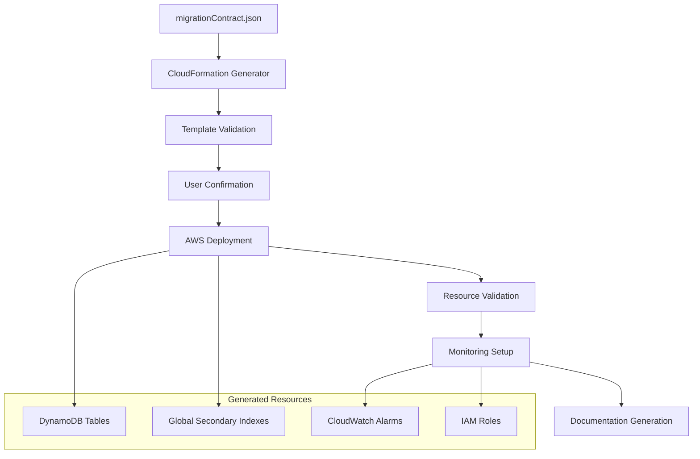

# Infrastructure Deployment - Design

## Overview

The Infrastructure Deployment stage transforms the migration contract into production-ready DynamoDB infrastructure using CloudFormation templates. The design emphasizes safety through retention policies, comprehensive monitoring, and user-controlled deployment with proper validation.

## Architecture

### Deployment Architecture



## Components and Interfaces

### 1. CloudFormation Template Generator
**Purpose**: Transform migration contract into deployable CloudFormation templates

**Template Generation Process**:
```typescript
interface CloudFormationGenerator {
    generateTemplate(contract: MigrationContract): CloudFormationTemplate;
    validateTemplate(template: CloudFormationTemplate): ValidationResult;
    addMonitoringResources(template: CloudFormationTemplate): CloudFormationTemplate;
}

class DynamoDBTemplateGenerator implements CloudFormationGenerator {
    generateTemplate(contract: MigrationContract): CloudFormationTemplate {
        const template: CloudFormationTemplate = {
            AWSTemplateFormatVersion: '2010-09-09',
            Description: 'DynamoDB tables for MySQL to DynamoDB migration',
            Resources: {},
            Outputs: {}
        };
        
        // Generate table resources from migration contract
        for (const tableConfig of contract) {
            if (tableConfig.type === 'Table') {
                template.Resources[tableConfig.table] = this.createTableResource(tableConfig);
                template.Outputs[`${tableConfig.table}Name`] = {
                    Description: `Name of ${tableConfig.table} table`,
                    Value: { Ref: tableConfig.table },
                    Export: { Name: `${tableConfig.table}-Name` }
                };
            }
        }
        
        return template;
    }
    
    private createTableResource(config: MigrationContractEntry): any {
        const tableResource = {
            Type: 'AWS::DynamoDB::Table',
            Properties: {
                TableName: config.table,
                BillingMode: 'ON_DEMAND', // Start with on-demand for flexibility
                AttributeDefinitions: this.createAttributeDefinitions(config),
                KeySchema: this.createKeySchema(config),
                DeletionProtectionEnabled: true,
                PointInTimeRecoverySpecification: {
                    PointInTimeRecoveryEnabled: true
                },
                SSESpecification: {
                    SSEEnabled: true
                },
                StreamSpecification: {
                    StreamViewType: 'NEW_AND_OLD_IMAGES'
                },
                Tags: [
                    { Key: 'Project', Value: 'MySQL-DynamoDB-Migration' },
                    { Key: 'Environment', Value: '${AWS::StackName}' }
                ]
            },
            DeletionPolicy: 'Retain', // CRITICAL: Prevent accidental deletion
            UpdateReplacePolicy: 'Retain'
        };
        
        // Add GSIs if defined
        if (config.gsis && config.gsis.length > 0) {
            tableResource.Properties.GlobalSecondaryIndexes = config.gsis.map(gsi => ({
                IndexName: gsi.name,
                KeySchema: [
                    { AttributeName: gsi.pk, KeyType: 'HASH' },
                    ...(gsi.sk ? [{ AttributeName: gsi.sk, KeyType: 'RANGE' }] : [])
                ],
                Projection: { ProjectionType: 'ALL' } // Can be optimized later
            }));
        }
        
        return tableResource;
    }
    
    private createAttributeDefinitions(config: MigrationContractEntry): any[] {
        const attributes = new Set<string>();
        
        // Add primary key attributes
        attributes.add(config.pk);
        if (config.sk) attributes.add(config.sk);
        
        // Add GSI key attributes
        if (config.gsis) {
            config.gsis.forEach(gsi => {
                attributes.add(gsi.pk);
                if (gsi.sk) attributes.add(gsi.sk);
            });
        }
        
        return Array.from(attributes).map(attr => ({
            AttributeName: attr,
            AttributeType: this.inferAttributeType(attr, config)
        }));
    }
    
    private inferAttributeType(attributeName: string, config: MigrationContractEntry): string {
        const attribute = config.attributes[attributeName];
        return attribute ? attribute.type : 'S'; // Default to String
    }
}
```

### 2. Deployment Management System
**Purpose**: Handle user interaction and AWS deployment process

**Deployment Process**:
```typescript
class DeploymentManager {
    async deployInfrastructure(
        template: CloudFormationTemplate,
        region: string,
        stackName: string
    ): Promise<DeploymentResult> {
        // Validate template before deployment
        const validation = await this.validateTemplate(template);
        if (!validation.isValid) {
            throw new Error(`Template validation failed: ${validation.errors.join(', ')}`);
        }
        
        // Prompt user for confirmation
        const userConfirmation = await this.promptUserConfirmation(template, region);
        if (!userConfirmation) {
            throw new Error('Deployment cancelled by user');
        }
        
        // Deploy to AWS
        const cloudFormation = new CloudFormationClient({ region });
        
        try {
            const deployCommand = new CreateStackCommand({
                StackName: stackName,
                TemplateBody: JSON.stringify(template),
                Capabilities: ['CAPABILITY_IAM'],
                Tags: [
                    { Key: 'Project', Value: 'MySQL-DynamoDB-Migration' },
                    { Key: 'DeployedBy', Value: 'Migration-Tool' },
                    { Key: 'DeploymentDate', Value: new Date().toISOString() }
                ]
            });
            
            const result = await cloudFormation.send(deployCommand);
            
            // Wait for stack creation to complete
            await this.waitForStackCompletion(cloudFormation, stackName);
            
            return {
                success: true,
                stackId: result.StackId!,
                region,
                deployedResources: await this.getDeployedResources(cloudFormation, stackName)
            };
            
        } catch (error) {
            throw new Error(`Deployment failed: ${error.message}`);
        }
    }
    
    private async promptUserConfirmation(
        template: CloudFormationTemplate,
        region: string
    ): Promise<boolean> {
        console.log('\n=== DEPLOYMENT CONFIRMATION ===');
        console.log(`Region: ${region}`);
        console.log(`Tables to be created: ${Object.keys(template.Resources).length}`);
        console.log('\nTables:');
        
        Object.keys(template.Resources).forEach(resourceName => {
            const resource = template.Resources[resourceName];
            if (resource.Type === 'AWS::DynamoDB::Table') {
                console.log(`  - ${resourceName}`);
            }
        });
        
        console.log('\nIMPORTANT: Tables will be created with DeletionPolicy: Retain');
        console.log('This means tables will NOT be deleted if the CloudFormation stack is deleted.');
        
        const response = await this.getUserInput('Do you want to proceed with deployment? (yes/no): ');
        return response.toLowerCase() === 'yes';
    }
}
```

### 3. Monitoring and Alerting Setup
**Purpose**: Configure comprehensive monitoring for deployed DynamoDB tables

**Monitoring Configuration**:
```typescript
class MonitoringSetup {
    addMonitoringToTemplate(template: CloudFormationTemplate): CloudFormationTemplate {
        const monitoringTemplate = { ...template };
        
        // Add CloudWatch alarms for each table
        Object.keys(template.Resources).forEach(resourceName => {
            const resource = template.Resources[resourceName];
            if (resource.Type === 'AWS::DynamoDB::Table') {
                this.addTableAlarms(monitoringTemplate, resourceName);
                this.addTableDashboard(monitoringTemplate, resourceName);
            }
        });
        
        return monitoringTemplate;
    }
    
    private addTableAlarms(template: CloudFormationTemplate, tableName: string): void {
        // Throttling alarm
        template.Resources[`${tableName}ThrottleAlarm`] = {
            Type: 'AWS::CloudWatch::Alarm',
            Properties: {
                AlarmName: `${tableName}-Throttling`,
                AlarmDescription: `Throttling detected on ${tableName}`,
                MetricName: 'ThrottledRequests',
                Namespace: 'AWS/DynamoDB',
                Statistic: 'Sum',
                Period: 300,
                EvaluationPeriods: 2,
                Threshold: 1,
                ComparisonOperator: 'GreaterThanOrEqualToThreshold',
                Dimensions: [
                    { Name: 'TableName', Value: { Ref: tableName } }
                ],
                AlarmActions: [
                    // Add SNS topic ARN for notifications
                ]
            }
        };
        
        // High error rate alarm
        template.Resources[`${tableName}ErrorAlarm`] = {
            Type: 'AWS::CloudWatch::Alarm',
            Properties: {
                AlarmName: `${tableName}-HighErrorRate`,
                AlarmDescription: `High error rate detected on ${tableName}`,
                MetricName: 'SystemErrors',
                Namespace: 'AWS/DynamoDB',
                Statistic: 'Sum',
                Period: 300,
                EvaluationPeriods: 2,
                Threshold: 10,
                ComparisonOperator: 'GreaterThanThreshold',
                Dimensions: [
                    { Name: 'TableName', Value: { Ref: tableName } }
                ]
            }
        };
        
        // Consumed capacity alarm (for cost monitoring)
        template.Resources[`${tableName}CapacityAlarm`] = {
            Type: 'AWS::CloudWatch::Alarm',
            Properties: {
                AlarmName: `${tableName}-HighCapacityUsage`,
                AlarmDescription: `High capacity usage on ${tableName}`,
                MetricName: 'ConsumedReadCapacityUnits',
                Namespace: 'AWS/DynamoDB',
                Statistic: 'Sum',
                Period: 3600, // 1 hour
                EvaluationPeriods: 1,
                Threshold: 1000000, // 1M RCUs per hour
                ComparisonOperator: 'GreaterThanThreshold',
                Dimensions: [
                    { Name: 'TableName', Value: { Ref: tableName } }
                ]
            }
        };
    }
}
```

### 4. Validation and Documentation System
**Purpose**: Validate deployment and generate comprehensive documentation

**Validation Process**:
```typescript
class DeploymentValidator {
    async validateDeployment(
        contract: MigrationContract,
        deployedResources: DeployedResource[]
    ): Promise<ValidationReport> {
        const report: ValidationReport = {
            isValid: true,
            validatedTables: [],
            issues: [],
            recommendations: []
        };
        
        for (const tableConfig of contract) {
            if (tableConfig.type === 'Table') {
                const validation = await this.validateTable(tableConfig, deployedResources);
                report.validatedTables.push(validation);
                
                if (!validation.isValid) {
                    report.isValid = false;
                    report.issues.push(...validation.issues);
                }
            }
        }
        
        return report;
    }
    
    private async validateTable(
        config: MigrationContractEntry,
        deployedResources: DeployedResource[]
    ): Promise<TableValidation> {
        const dynamodb = new DynamoDBClient({});
        
        try {
            const describeResult = await dynamodb.send(
                new DescribeTableCommand({ TableName: config.table })
            );
            
            const table = describeResult.Table!;
            const validation: TableValidation = {
                tableName: config.table,
                isValid: true,
                issues: []
            };
            
            // Validate key schema
            this.validateKeySchema(config, table, validation);
            
            // Validate GSIs
            this.validateGSIs(config, table, validation);
            
            // Validate table settings
            this.validateTableSettings(table, validation);
            
            return validation;
            
        } catch (error) {
            return {
                tableName: config.table,
                isValid: false,
                issues: [`Table not found or inaccessible: ${error.message}`]
            };
        }
    }
}
```

## Data Models

### Migration Contract Entry (Reference)
```typescript
interface MigrationContractEntry {
    table: string;
    type: 'Table' | 'GSI';
    source_table: string;
    pk: string;
    sk?: string;
    gsis?: GSIDefinition[];
    attributes: Record<string, AttributeDefinition>;
    satisfies: string[];
    estimated_item_size_bytes: number;
}
```

### Deployment Result
```typescript
interface DeploymentResult {
    success: boolean;
    stackId: string;
    region: string;
    deployedResources: DeployedResource[];
    monitoringSetup: MonitoringConfiguration;
    documentation: DeploymentDocumentation;
}
```

### Validation Report
```typescript
interface ValidationReport {
    isValid: boolean;
    validatedTables: TableValidation[];
    issues: string[];
    recommendations: string[];
    deploymentSummary: DeploymentSummary;
}
```

## Error Handling

### Template Generation Errors
- Invalid migration contract format
- Missing required fields in contract
- Conflicting table or GSI names
- Invalid attribute type mappings

### Deployment Errors
- AWS authentication failures
- Insufficient permissions for resource creation
- Resource limit exceeded (table limits, etc.)
- CloudFormation template validation failures

### Validation Errors
- Table schema mismatch with contract
- Missing GSIs or incorrect configurations
- Monitoring setup failures
- Access permission issues

## Security Considerations

### IAM Permissions
- Minimum required permissions for deployment
- Separate roles for deployment vs application access
- Cross-account access considerations
- Audit logging for all deployment activities

### Data Protection
- Encryption at rest enabled by default
- Encryption in transit for all communications
- Backup and point-in-time recovery enabled
- Access logging and monitoring

### Network Security
- VPC endpoint configuration where applicable
- Security group and NACL considerations
- Private subnet deployment options
- Network access logging

## Cost Optimization

### Billing Mode Selection
- On-demand vs provisioned capacity analysis
- Auto-scaling configuration for provisioned mode
- Reserved capacity considerations for stable workloads
- Cost monitoring and alerting setup

### Storage Optimization
- GSI projection optimization (KEYS_ONLY vs ALL)
- TTL configuration for temporary data
- Compression and data archival strategies
- Storage class optimization