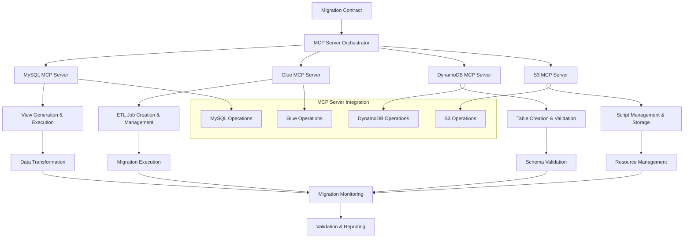

# Data Migration Execution - Design

## Overview

The Data Migration Execution stage implements a comprehensive MCP server-driven approach to migrate data from MySQL to DynamoDB. The design emphasizes proper MCP server integration, replacing subprocess calls with native MCP server operations for MySQL, AWS Glue, DynamoDB, and S3 services.

## Architecture

### MCP Server-Driven Migration Architecture



## Components and Interfaces

### 1. MCP Server Orchestrator
**Purpose**: Coordinate operations across multiple MCP servers and manage migration workflow

**Orchestration Process**:
```typescript
interface MCPServerOrchestrator {
    validateMCPServers(): Promise<MCPServerStatus>;
    executeMigration(contract: MigrationContract): Promise<MigrationResult>;
    monitorProgress(): Promise<ProgressReport>;
    handleErrors(error: MCPError): Promise<ErrorResolution>;
}

class DataMigrationOrchestrator implements MCPServerOrchestrator {
    private mysqlMCP: MySQLMCPClient;
    private glueMCP: GlueMCPClient;
    private dynamodbMCP: DynamoDBMCPClient;
    private s3MCP: S3MCPClient;
    
    constructor() {
        this.mysqlMCP = new MySQLMCPClient();
        this.glueMCP = new GlueMCPClient();
        this.dynamodbMCP = new DynamoDBMCPClient();
        this.s3MCP = new S3MCPClient();
    }
    
    async validateMCPServers(): Promise<MCPServerStatus> {
        const validations = await Promise.all([
            this.validateMySQLMCP(),
            this.validateGlueMCP(),
            this.validateDynamoDBMCP(),
            this.validateS3MCP()
        ]);
        
        return {
            allServersOperational: validations.every(v => v.isOperational),
            serverStatuses: validations,
            readyForMigration: validations.every(v => v.isOperational && v.hasRequiredPermissions)
        };
    }
    
    async executeMigration(contract: MigrationContract): Promise<MigrationResult> {
        // Phase 1: MySQL View Generation and Execution
        const viewResults = await this.executeViewGeneration(contract);
        
        // Phase 2: DynamoDB Table Creation
        const tableResults = await this.createDynamoDBTables(contract);
        
        // Phase 3: Glue ETL Job Creation and Execution
        const migrationResults = await this.executeGlueJobs(contract, viewResults, tableResults);
        
        // Phase 4: Data Validation and Reporting
        const validationResults = await this.validateMigration(contract, migrationResults);
        
        return {
            success: validationResults.isValid,
            viewsCreated: viewResults.createdViews,
            tablesCreated: tableResults.createdTables,
            jobsExecuted: migrationResults.executedJobs,
            validationReport: validationResults,
            migrationMetrics: this.generateMetrics(viewResults, tableResults, migrationResults)
        };
    }
    
    private async validateMySQLMCP(): Promise<MCPServerValidation> {
        try {
            const connectionTest = await this.mysqlMCP.testConnection();
            const permissionTest = await this.mysqlMCP.validatePermissions(['CREATE VIEW', 'SELECT', 'SHOW TABLES']);
            
            return {
                serverType: 'MySQL MCP',
                isOperational: connectionTest.success,
                hasRequiredPermissions: permissionTest.hasAllPermissions,
                lastChecked: new Date(),
                details: {
                    connectionInfo: connectionTest.connectionInfo,
                    availableOperations: permissionTest.availableOperations
                }
            };
        } catch (error) {
            return {
                serverType: 'MySQL MCP',
                isOperational: false,
                hasRequiredPermissions: false,
                lastChecked: new Date(),
                error: error.message
            };
        }
    }
    
    private async validateGlueMCP(): Promise<MCPServerValidation> {
        try {
            const serviceTest = await this.glueMCP.testService();
            const permissionTest = await this.glueMCP.validatePermissions([
                'glue:CreateJob',
                'glue:StartJobRun',
                'glue:GetJobRun',
                's3:PutObject',
                's3:GetObject'
            ]);
            
            return {
                serverType: 'Glue MCP',
                isOperational: serviceTest.success,
                hasRequiredPermissions: permissionTest.hasAllPermissions,
                lastChecked: new Date(),
                details: {
                    availableRegions: serviceTest.availableRegions,
                    supportedJobTypes: serviceTest.supportedJobTypes
                }
            };
        } catch (error) {
            return {
                serverType: 'Glue MCP',
                isOperational: false,
                hasRequiredPermissions: false,
                lastChecked: new Date(),
                error: error.message
            };
        }
    }
}
```

### 2. MySQL MCP Integration System
**Purpose**: Handle all MySQL operations through MCP server calls

**MySQL Operations**:
```typescript
interface MySQLMCPClient {
    discoverConnection(): Promise<MySQLConnectionInfo>;
    executeQuery(query: string): Promise<QueryResult>;
    createView(viewDefinition: ViewDefinition): Promise<ViewCreationResult>;
    validateView(viewName: string): Promise<ViewValidationResult>;
}

class MySQLMCPOperations implements MySQLMCPClient {
    private mcpClient: MCPClient;
    
    constructor(mcpEndpoint: string) {
        this.mcpClient = new MCPClient(mcpEndpoint);
    }
    
    async discoverConnection(): Promise<MySQLConnectionInfo> {
        const response = await this.mcpClient.call('mysql_discover_connection', {
            discovery_hosts: ['localhost', '127.0.0.1'],
            discovery_ports: [3306, 3307, 33060],
            discovery_users: ['root', 'mysql', 'admin'],
            timeout: 30
        });
        
        if (!response.success) {
            throw new Error(`MySQL connection discovery failed: ${response.error}`);
        }
        
        return {
            host: response.connection.host,
            port: response.connection.port,
            user: response.connection.user,
            database: response.connection.database,
            availableDatabases: response.connection.available_databases
        };
    }
    
    async createView(viewDefinition: ViewDefinition): Promise<ViewCreationResult> {
        const response = await this.mcpClient.call('mysql_execute_ddl', {
            query: viewDefinition.sql,
            operation_type: 'CREATE_VIEW',
            view_name: viewDefinition.name
        });
        
        if (!response.success) {
            throw new Error(`View creation failed for ${viewDefinition.name}: ${response.error}`);
        }
        
        return {
            viewName: viewDefinition.name,
            created: true,
            rowCount: await this.getViewRowCount(viewDefinition.name),
            executionTime: response.execution_time
        };
    }
    
    async generateViewsFromContract(contract: MigrationContract): Promise<ViewGenerationResult[]> {
        const results: ViewGenerationResult[] = [];
        
        for (const tableConfig of contract.tables) {
            try {
                const viewDefinition = this.generateViewDefinition(tableConfig);
                const creationResult = await this.createView(viewDefinition);
                
                results.push({
                    tableName: tableConfig.table,
                    viewName: viewDefinition.name,
                    success: true,
                    result: creationResult
                });
            } catch (error) {
                results.push({
                    tableName: tableConfig.table,
                    viewName: `ddb_${tableConfig.table.toLowerCase()}_view`,
                    success: false,
                    error: error.message
                });
            }
        }
        
        return results;
    }
    
    private generateViewDefinition(tableConfig: MigrationContractEntry): ViewDefinition {
        const viewName = `ddb_${tableConfig.table.toLowerCase()}_view`;
        let sql = `CREATE OR REPLACE VIEW ${viewName} AS SELECT `;
        
        // Build SELECT clause based on attributes and join patterns
        const selectClauses: string[] = [];
        
        for (const attribute of tableConfig.attributes) {
            if (attribute.join) {
                selectClauses.push(this.generateJoinClause(attribute));
            } else {
                selectClauses.push(`${tableConfig.source_table}.${attribute.source_column} AS ${attribute.name}`);
            }
        }
        
        sql += selectClauses.join(', ');
        sql += ` FROM ${tableConfig.source_table}`;
        
        // Add JOIN clauses for complex patterns
        const joinClauses = this.generateJoinClauses(tableConfig);
        if (joinClauses.length > 0) {
            sql += ' ' + joinClauses.join(' ');
        }
        
        return {
            name: viewName,
            sql: sql,
            sourceTable: tableConfig.source_table,
            targetTable: tableConfig.table
        };
    }
    
    private generateJoinClause(attribute: AttributeDefinition): string {
        switch (attribute.join.type) {
            case 'self-join':
                return `COALESCE(${attribute.join.join_alias}.${attribute.join.select_column}, '${attribute.join.null_value}') AS ${attribute.name}`;
            
            case 'foreign-key':
                return `${attribute.join.target_table}.${attribute.join.select_column} AS ${attribute.name}`;
            
            case 'chain':
                if (attribute.join.chain_separator) {
                    const chainParts = attribute.join.joins.map(join => join.select_column);
                    return `CONCAT_WS('${attribute.join.chain_separator}', ${chainParts.join(', ')}) AS ${attribute.name}`;
                } else {
                    const lastJoin = attribute.join.joins[attribute.join.joins.length - 1];
                    return `${lastJoin.target_table}.${lastJoin.select_column} AS ${attribute.name}`;
                }
            
            case 'conditional':
                return `CASE WHEN ${attribute.join.condition} THEN ${attribute.join.target_table}.${attribute.join.select_column} ELSE '${attribute.join.else_value}' END AS ${attribute.name}`;
            
            case 'json-construction':
                return `(SELECT JSON_ARRAYAGG(JSON_OBJECT(${this.buildJsonObjectFields(attribute.join.construction.select_columns)})) FROM ${attribute.join.target_table} WHERE ${attribute.join.join_condition} ${attribute.join.construction.order_by ? 'ORDER BY ' + attribute.join.construction.order_by : ''} ${attribute.join.construction.limit ? 'LIMIT ' + attribute.join.construction.limit : ''}) AS ${attribute.name}`;
            
            default:
                throw new Error(`Unsupported join type: ${attribute.join.type}`);
        }
    }
}
```

### 3. Glue MCP Integration System
**Purpose**: Handle all AWS Glue operations through MCP server calls

**Glue Operations**:
```typescript
interface GlueMCPClient {
    createJob(jobDefinition: GlueJobDefinition): Promise<JobCreationResult>;
    startJobRun(jobName: string, parameters?: Record<string, string>): Promise<JobRunResult>;
    monitorJobRun(jobName: string, runId: string): Promise<JobRunStatus>;
    getJobLogs(jobName: string, runId: string): Promise<JobLogs>;
}

class GlueMCPOperations implements GlueMCPClient {
    private mcpClient: MCPClient;
    private s3MCP: S3MCPClient;
    
    constructor(mcpEndpoint: string, s3MCPClient: S3MCPClient) {
        this.mcpClient = new MCPClient(mcpEndpoint);
        this.s3MCP = s3MCPClient;
    }
    
    async createJob(jobDefinition: GlueJobDefinition): Promise<JobCreationResult> {
        // First, upload the script to S3 via S3 MCP
        const scriptUploadResult = await this.s3MCP.uploadObject({
            bucket: jobDefinition.scriptBucket,
            key: jobDefinition.scriptKey,
            content: jobDefinition.scriptContent,
            contentType: 'text/x-python'
        });
        
        if (!scriptUploadResult.success) {
            throw new Error(`Failed to upload Glue script: ${scriptUploadResult.error}`);
        }
        
        // Create the Glue job via MCP
        const response = await this.mcpClient.call('glue_create_job', {
            job_name: jobDefinition.jobName,
            role_arn: jobDefinition.roleArn,
            script_location: `s3://${jobDefinition.scriptBucket}/${jobDefinition.scriptKey}`,
            command_name: 'pythonshell',
            python_version: '3.9',
            max_retries: 0,
            timeout: 60,
            default_arguments: {
                '--additional-python-modules': 'mysql-connector-python,boto3'
            }
        });
        
        if (!response.success) {
            throw new Error(`Glue job creation failed: ${response.error}`);
        }
        
        return {
            jobName: jobDefinition.jobName,
            jobArn: response.job_arn,
            scriptLocation: `s3://${jobDefinition.scriptBucket}/${jobDefinition.scriptKey}`,
            created: true
        };
    }
    
    async startJobRun(jobName: string, parameters?: Record<string, string>): Promise<JobRunResult> {
        const response = await this.mcpClient.call('glue_start_job_run', {
            job_name: jobName,
            arguments: parameters || {}
        });
        
        if (!response.success) {
            throw new Error(`Failed to start Glue job ${jobName}: ${response.error}`);
        }
        
        return {
            jobName: jobName,
            runId: response.job_run_id,
            status: 'STARTING',
            startedAt: new Date()
        };
    }
    
    async monitorJobRun(jobName: string, runId: string): Promise<JobRunStatus> {
        const response = await this.mcpClient.call('glue_get_job_run', {
            job_name: jobName,
            run_id: runId
        });
        
        if (!response.success) {
            throw new Error(`Failed to get job run status: ${response.error}`);
        }
        
        return {
            jobName: jobName,
            runId: runId,
            status: response.job_run.job_run_state,
            startedAt: new Date(response.job_run.started_on),
            completedAt: response.job_run.completed_on ? new Date(response.job_run.completed_on) : undefined,
            errorMessage: response.job_run.error_message,
            executionTime: response.job_run.execution_time
        };
    }
    
    async createJobsFromContract(
        contract: MigrationContract,
        mysqlConnection: MySQLConnectionInfo,
        createdViews: string[]
    ): Promise<GlueJobCreationResult[]> {
        const results: GlueJobCreationResult[] = [];
        
        for (const tableConfig of contract.tables) {
            const viewName = `ddb_${tableConfig.table.toLowerCase()}_view`;
            
            if (!createdViews.includes(viewName)) {
                results.push({
                    tableName: tableConfig.table,
                    jobName: `${tableConfig.table.toLowerCase()}_migration_job`,
                    success: false,
                    error: `View ${viewName} not found in created views`
                });
                continue;
            }
            
            try {
                const jobDefinition = this.generateJobDefinition(tableConfig, mysqlConnection, viewName);
                const creationResult = await this.createJob(jobDefinition);
                
                results.push({
                    tableName: tableConfig.table,
                    jobName: jobDefinition.jobName,
                    success: true,
                    result: creationResult
                });
            } catch (error) {
                results.push({
                    tableName: tableConfig.table,
                    jobName: `${tableConfig.table.toLowerCase()}_migration_job`,
                    success: false,
                    error: error.message
                });
            }
        }
        
        return results;
    }
    
    private generateJobDefinition(
        tableConfig: MigrationContractEntry,
        mysqlConnection: MySQLConnectionInfo,
        viewName: string
    ): GlueJobDefinition {
        const jobName = `${tableConfig.table.toLowerCase()}_migration_job`;
        const scriptContent = this.generateETLScript(tableConfig, mysqlConnection, viewName);
        
        return {
            jobName: jobName,
            roleArn: process.env.GLUE_ROLE_ARN!,
            scriptBucket: process.env.S3_SCRIPT_BUCKET!,
            scriptKey: `migration-scripts/${jobName}.py`,
            scriptContent: scriptContent,
            sourceView: viewName,
            targetTable: tableConfig.table
        };
    }
    
    private generateETLScript(
        tableConfig: MigrationContractEntry,
        mysqlConnection: MySQLConnectionInfo,
        viewName: string
    ): string {
        return `
import sys
import boto3
import mysql.connector
from awsglue.utils import getResolvedOptions
import json

# Get job arguments
args = getResolvedOptions(sys.argv, ['JOB_NAME'])

def main():
    # Connect to MySQL
    mysql_conn = mysql.connector.connect(
        host='${mysqlConnection.host}',
        port=${mysqlConnection.port},
        user='${mysqlConnection.user}',
        password='',
        database='${mysqlConnection.database}'
    )
    
    # Connect to DynamoDB
    dynamodb = boto3.resource('dynamodb', region_name='${process.env.AWS_REGION}')
    table = dynamodb.Table('${tableConfig.table}')
    
    try:
        cursor = mysql_conn.cursor(dictionary=True)
        cursor.execute('SELECT * FROM ${viewName}')
        
        batch_size = 25  # DynamoDB batch write limit
        batch = []
        total_processed = 0
        
        for row in cursor:
            # Convert row to DynamoDB item format
            item = {}
            for key, value in row.items():
                if value is not None:
                    if isinstance(value, (int, float)):
                        item[key] = {'N': str(value)}
                    elif isinstance(value, bool):
                        item[key] = {'BOOL': value}
                    else:
                        item[key] = {'S': str(value)}
            
            batch.append({'PutRequest': {'Item': item}})
            
            # Write batch when full
            if len(batch) >= batch_size:
                response = table.batch_writer().batch_write_item(
                    RequestItems={'${tableConfig.table}': batch}
                )
                total_processed += len(batch)
                batch = []
                print(f'Processed {total_processed} records')
        
        # Write remaining items
        if batch:
            table.batch_writer().batch_write_item(
                RequestItems={'${tableConfig.table}': batch}
            )
            total_processed += len(batch)
        
        print(f'✅ Migration completed: {total_processed} records migrated to ${tableConfig.table}')
        
    except Exception as e:
        print(f'❌ Migration failed for ${tableConfig.table}: {str(e)}')
        raise e
    finally:
        mysql_conn.close()

if __name__ == '__main__':
    main()
`;
    }
}
```

### 4. DynamoDB MCP Integration System
**Purpose**: Handle all DynamoDB operations through MCP server calls

**DynamoDB Operations**:
```typescript
interface DynamoDBMCPClient {
    createTable(tableDefinition: DynamoDBTableDefinition): Promise<TableCreationResult>;
    describeTable(tableName: string): Promise<TableDescription>;
    validateTableSchema(tableName: string, expectedSchema: TableSchema): Promise<SchemaValidationResult>;
    monitorTableMetrics(tableName: string): Promise<TableMetrics>;
}

class DynamoDBMCPOperations implements DynamoDBMCPClient {
    private mcpClient: MCPClient;
    
    constructor(mcpEndpoint: string) {
        this.mcpClient = new MCPClient(mcpEndpoint);
    }
    
    async createTable(tableDefinition: DynamoDBTableDefinition): Promise<TableCreationResult> {
        const response = await this.mcpClient.call('dynamodb_create_table', {
            table_name: tableDefinition.tableName,
            key_schema: tableDefinition.keySchema,
            attribute_definitions: tableDefinition.attributeDefinitions,
            billing_mode: 'PAY_PER_REQUEST',
            global_secondary_indexes: tableDefinition.globalSecondaryIndexes,
            stream_specification: {
                stream_enabled: true,
                stream_view_type: 'NEW_AND_OLD_IMAGES'
            },
            point_in_time_recovery_specification: {
                point_in_time_recovery_enabled: true
            },
            sse_specification: {
                enabled: true
            },
            deletion_protection_enabled: true
        });
        
        if (!response.success) {
            if (response.error.includes('ResourceInUseException')) {
                return {
                    tableName: tableDefinition.tableName,
                    created: false,
                    alreadyExists: true,
                    tableArn: await this.getTableArn(tableDefinition.tableName)
                };
            }
            throw new Error(`Table creation failed: ${response.error}`);
        }
        
        return {
            tableName: tableDefinition.tableName,
            created: true,
            tableArn: response.table_description.table_arn,
            tableStatus: response.table_description.table_status
        };
    }
    
    async createTablesFromContract(contract: MigrationContract): Promise<TableCreationResult[]> {
        const results: TableCreationResult[] = [];
        
        for (const tableConfig of contract.tables) {
            try {
                const tableDefinition = this.generateTableDefinition(tableConfig);
                const creationResult = await this.createTable(tableDefinition);
                
                results.push(creationResult);
            } catch (error) {
                results.push({
                    tableName: tableConfig.table,
                    created: false,
                    error: error.message
                });
            }
        }
        
        return results;
    }
    
    private generateTableDefinition(tableConfig: MigrationContractEntry): DynamoDBTableDefinition {
        const keySchema = [
            { AttributeName: tableConfig.pk, KeyType: 'HASH' }
        ];
        
        const attributeDefinitions = [
            { AttributeName: tableConfig.pk, AttributeType: 'S' }
        ];
        
        if (tableConfig.sk) {
            keySchema.push({ AttributeName: tableConfig.sk, KeyType: 'RANGE' });
            attributeDefinitions.push({ AttributeName: tableConfig.sk, AttributeType: 'S' });
        }
        
        const globalSecondaryIndexes = tableConfig.gsis?.map(gsi => {
            const gsiKeySchema = [{ AttributeName: gsi.pk, KeyType: 'HASH' }];
            
            if (!attributeDefinitions.find(attr => attr.AttributeName === gsi.pk)) {
                attributeDefinitions.push({ AttributeName: gsi.pk, AttributeType: 'S' });
            }
            
            if (gsi.sk) {
                gsiKeySchema.push({ AttributeName: gsi.sk, KeyType: 'RANGE' });
                if (!attributeDefinitions.find(attr => attr.AttributeName === gsi.sk)) {
                    attributeDefinitions.push({ AttributeName: gsi.sk, AttributeType: 'S' });
                }
            }
            
            return {
                IndexName: gsi.index_name,
                KeySchema: gsiKeySchema,
                Projection: { ProjectionType: 'ALL' }
            };
        }) || [];
        
        return {
            tableName: tableConfig.table,
            keySchema: keySchema,
            attributeDefinitions: attributeDefinitions,
            globalSecondaryIndexes: globalSecondaryIndexes
        };
    }
}
```

## Data Models

### MCP Server Status
```typescript
interface MCPServerStatus {
    allServersOperational: boolean;
    serverStatuses: MCPServerValidation[];
    readyForMigration: boolean;
}

interface MCPServerValidation {
    serverType: string;
    isOperational: boolean;
    hasRequiredPermissions: boolean;
    lastChecked: Date;
    details?: any;
    error?: string;
}
```

### Migration Result
```typescript
interface MigrationResult {
    success: boolean;
    viewsCreated: string[];
    tablesCreated: string[];
    jobsExecuted: string[];
    validationReport: ValidationReport;
    migrationMetrics: MigrationMetrics;
}

interface MigrationMetrics {
    totalRecordsMigrated: number;
    migrationDuration: number;
    averageThroughput: number;
    errorRate: number;
    tableMetrics: TableMigrationMetrics[];
}
```

## Error Handling

### MCP Server Communication Errors
- Server unavailability or timeout errors
- Authentication and permission failures
- Network connectivity issues
- Invalid request format or parameters

### Migration-Specific Errors
- MySQL view creation failures
- DynamoDB table creation conflicts
- Glue job execution failures
- Data validation and integrity issues

### Recovery Mechanisms
- Automatic retry with exponential backoff
- Circuit breaker patterns for persistent failures
- Graceful degradation and partial migration support
- Comprehensive error logging and reporting

## Performance Optimization

### Batch Processing
- Optimize batch sizes for DynamoDB writes
- Parallel processing for independent tables
- Memory-efficient data streaming
- Connection pooling and reuse

### Monitoring and Alerting
- Real-time progress tracking
- Performance metrics collection
- Capacity utilization monitoring
- Error rate and latency tracking

This design replaces subprocess calls with proper MCP server integration, providing better error handling, monitoring, and maintainability while leveraging the full capabilities of specialized MCP servers for each service.