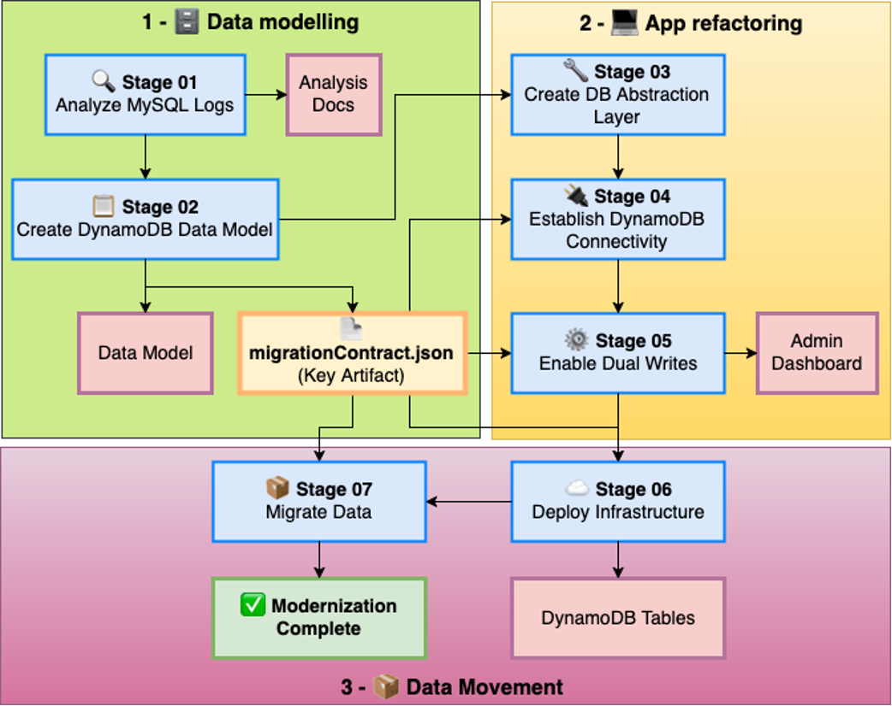

# Database Modernizer Workflow Guide 🚀

This guide provides step-by-step instructions for executing the complete database modernization workflow from MySQL to DynamoDB using AWS services and AI-powered automation.

The modernization workflow consists of 7 stages that you need to run to incrementally modernize your application. 



For simplicity, during this workshop you will be working with some stages that were alreaady generated, however you can find the clean files to run this workshop on your own in the `workshops/modernizer/clean-start` folder. When we execute this workshop from scratch, it takes around 11 hours to complete. 

We want you focused on the most important sections of this workshop:

- **Stage 02:** Amazon DynamoDB Data modelling, where you can spend time with the MCP server discussing about the data modelling options you have, and decide how many tables you will have and why. 
- **Stage 06:** Create the DynamoDB tables in the AWS cloud
- **Stage 07:** Understand the migration strategies, and how this application works with them, how to control Reads and Writes without impacting your application traffic. 


## ⚠️ CRITICAL: Prerequisites & Setup

> **🛑 STOP! Read this entire section before proceeding**
>
> **Failure to complete these prerequisites will result in migration failures**

### 1. AWS Infrastructure Deployment

Deploy the `modernizer-db.yaml` CloudFormation template to create the required infrastructure:

**What it creates:**
- MySQL database (simulates on-premises setup)
- VPC and networking configuration
- AWS Glue roles and connections
- Security groups and IAM permissions

**⚠️ Requirements:**
- Your **public IP address** for database connectivity
- AWS account with appropriate permissions
- CloudFormation deployment access

**🕐 Post-Deployment Wait Time:**
- **Wait 5+ minutes** after CloudFormation completes
- Background scripts install prerequisites on EC2 instance
- **Do not proceed until wait time is complete**

**🔧 Manual Configuration Step:**
1. Go to **AWS Glue Connections** console
2. Edit connection named `mysql-modernizer-connection`
3. Update password (found in CloudFormation outputs)
4. **Save the connection**

> **💥 CRITICAL:** If you skip the password update, all ETL processes will fail!

### 2. MCP Server Configuration

**Required:** Configure these 3 MCP servers in your IDE settings:

#### 📊 DynamoDB MCP Server
[GitHub Repository](https://github.com/awslabs/mcp/tree/main/src/dynamodb-mcp-server)

```json
{
  "mcpServers": {
    "dynamodb-server": {
      "command": "uvx",
      "args": ["awslabs.dynamodb-mcp-server@latest"],
      "env": {
        "DDB-MCP-READONLY": "true",
        "AWS_PROFILE": "default",
        "AWS_REGION": "us-east-2",
        "FASTMCP_LOG_LEVEL": "ERROR"
      },
      "disabled": false,
      "autoApprove": []
    }
  }
}
```

#### ⚙️ AWS Data Processing MCP Server (Glue)
[GitHub Repository](https://github.com/awslabs/mcp/tree/main/src/aws-dataprocessing-mcp-server)

```json
{
  "mcpServers": {
    "data-processing-mcp": {
      "autoApprove": [],
      "disabled": false,
      "command": "uvx",
      "args": [
        "awslabs.aws-dataprocessing-mcp-server@latest",
        "--allow-write"
      ],
      "env": {
        "FASTMCP_LOG_LEVEL": "ERROR",
        "AWS_REGION": "us-east-2"
      },
      "transportType": "stdio"
    }
  }
}
```

#### 💾 MySQL MCP Server
[GitHub Repository](https://github.com/designcomputer/mysql_mcp_server)

**⚠️ Update these values from your CloudFormation deployment:**

```json
{
  "mcpServers": {
    "modernizer-mysql-mcp-server": {
      "type": "stdio",
      "command": "uvx",
      "args": [
        "--from",
        "mysql-mcp-server",
        "mysql_mcp_server"
      ],
      "env": {
        "MYSQL_HOST": "<PUBLIC IP FROM EC2>",
        "MYSQL_PORT": "3306",
        "MYSQL_USER": "dbuser",
        "MYSQL_PASSWORD": "<YOUR PASSWORD FROM CLOUD FORMATION>",
        "MYSQL_DATABASE": "online_shopping_store"
      }
    }
  }
}
```

### ETL tool configuration

Please update the content of `tools/config.json` it should match your environment's information that is available in the cloud formation template. 

```json
{
  "aws": {
    "account_id": "<YOUR AWS ACCOUNT>",
    "region": "<AWS REGION  >",
    "s3_bucket": "<CF OUTPUT - S3 BUCKET NAME>",
    "glue_role": "<CF OUTPUT - GLUE SERVICE ROLE>",
    "vpc_id": "<CF OUTPUT - VPC ID>",
    "subnet_ids": ["<CF OUTPUT - SUBNET ID>"],
    "security_group_ids": ["<CF OUTPUT - SECURITY GROUP ID>"]
  },
  "mysql": {
    "public_host": "<CF OUTPUT - EC2 PUBLIC IP ADDRESS >",
    "private_host": "<CF OUTPUT - EC2 PRIVATE IP ADRESS>",
    "port": 3306,
    "user": "dbuser",
    "password": "<CF OUTPUT - DATABASE PASSWORD>",
    "database": "online_shopping_store"
  },
  "migration": {
    "contract_file": "../artifacts/stage-02/migrationContract.json",
    "view_generator": "generate_mysql_views.py",
    "s3_script_prefix": "etl-scripts/"
  }
}
```


> **🔄 Important:** Ensure all servers use the same AWS region (`us-east-2`)

## 🚀 Execution Instructions

### Starting the Workflow

Once prerequisites are complete, begin with:

```
Please execute the first task as instructed in this file `prompts/01-mysql-analysis/tasks.md`.
```

### 🧠 AI Guidance Notes

> **⚠️ Important:** Due to the non-deterministic nature of AI, outputs may vary between executions. 
> 
> **Your role:** Evaluate outputs and guide the AI toward correct solutions when needed.

## 📊 Data Modeling Context

When prompted during the data modeling phase, provide this business context:

Summarized:
```
Business Requirements:
- Expecting 100x growth in user base and transactions
- Admin operations are minimal, exposed via APIs
- Users can become "admins" for their own products
- Open to DynamoDB integration and modernization approaches

Migration Strategy:
- Don't need to preserve original UUIDs/IDs from MySQL
- Can create new identifiers (e.g., username-based keys)
- Keep both old and new IDs during migration for consistency
- Goal is complete application modernization

New Feature Request:
- Implement "hot products" by category feature
- Retrieve sorted list of best-selling products per category
- This has been a long-requested business requirement
```

Raw prompt

```
We are expecting to have 100x growth.
We do have some admin operations but they are very minimal in nature, they are exposed via the APIs, admins are the same users, a user can become a "admin" for the products.
I am open to integrate this to DynamoDB, but could we find another way to do this in dynamoDB?
In an additional note we don't need to keep the unique UUIDs or IDs from the relational database, we can just create new IDs for example using the username as unique identifier to get the information from DynamoDB, but for consistency during migration phase we should keep both, ideally we want to modernize this application. 

There has been something we wanted to achieve for a long time and it is to get a list of the “hot products” by category, where we will retrieve a nice sorted list of the best sellers
```

## Detailed Data model prompts
```
Users table. 

We can have different entities in the users table, we will use a partition key PK as a sort key as SK where we will store different entities. This table will have a GSI1, with a partition key of GSI1PK and sort key of GSI1SK. This table will have a GSI2, with a partition key of GSI2PK and sort key of GSI2SK. 

USER Entity: Where the PK = <user_email>,  SK = #META  (with all the attributes such as) 

| Attribute | Type | Purpose |
|-----------|------|---------|
| PK | String | email |
| SK | String | #META |
| username | String | Unique username |
| email | String | Unique email |
| password_hash | String | Encrypted password |
| profile_data | Map | User profile data |
| is_seller | Boolean | Seller status flag |
| seller_profile | Map | Seller-specific data |
| created_at | String | ISO timestamp |
| updated_at | String | ISO timestamp |
| status | String | active/inactive |


This entity will have a GSI on <userid> to allow legacy queries, where the GSI1PK = <user_id> and the GSI1SK = <user_id> and GSI2PK = username and GSI2SK = username for the other possible queries, this is only needed during migration, as once the application is moved to email as primary identifier there will be no need of the 2 GSIS.


SHOPPING CART entity: Where the PK = <user_email> and the SK = CART#<product_id> With the attributes:

| Attribute | Type | Purpose |
|-----------|------|---------|
| PK | String | email |
| SK | String | "CART#" + product_id |
| product_id | String | Product identifier |
| quantity | Number | Item quantity |
| price | Number | Price at add time |
| product_name | String | Denormalized product name |
| seller_id | String | Denormalized seller info |
| created_at | String | ISO timestamp |
| updated_at | String | ISO timestamp |

There is no need on shopping cart as it will only accessible to the user, so you only need to access individuals shopping cart. 

ORDER entity: Where the PK = <user_email> and the SK = ORDER#<isodate>#OrderID

**ORDER Entity (PK = user_email, SK = ORDER#isodate#OrderID)**


| Attribute | Type | Purpose |
|-----------|------|---------|
| PK | String | email |
| SK | String | ORDER#<created_at>#<order_id> |
| user_id | String | Customer identifier |
| order_status | String | pending/confirmed/shipped/delivered |
| total_amount | Number | Order total |
| order_items | List | Denormalized product details |
| shipping_address | Map | Delivery information |
| payment_info | Map | Payment method (encrypted) |
| seller_orders | Map | Orders grouped by seller |
| created_at | String | ISO timestamp |
| updated_at | String | ISO timestamp |
| order_id | String | UUID |

You can have a GSI on GSI1PK = <orderid> and GSI1SK = <orderid> to retrieve by order ID.


**GSI-1: Legacy User ID Support (Migration Only)**
- PK: GSI1PK = user_id, SK: GSI1SK = user_id
- Projection: ALL
- Purpose: Legacy queries during migration 
**GSI-2: Username Lookup (Migration Only)**
- PK: GSI2PK = username, SK: GSI2SK = username
- Projection: ALL
- Purpose: Username-based queries during migration
**GSI-3: Order Lookup**
- PK: GSI3PK = order_id, SK: GSI3SK = order_id
- Projection: ALL
- Purpose: Direct order retrieval

Categories Table

It contains two entities:

**ROOT Categories (PK = ROOT, SK = category_name)**
**CHILD Categories (PK = parent_category_name, SK = category_name)**


| Attribute | Type | Purpose |
|-----------|------|---------|
| PK | String | parent_category_name (ROOT for root categories) |
| SK | String | category_name |
| parent_name | String | Parent category name (null for roots) |
| category_name | String | Category display name |
| category_path | String | Full hierarchy path |
| level | Number | Hierarchy level (0 = root) |
| children_count | Number | Number of child categories |
| product_count | Number | Number of products |
| created_at | String | ISO timestamp |


Products Table

For simplicity let's have a table with PK = product_id and SK = #META this allow us future expansion if we need to start denormalizing the attributes. (MAKE SURE THE ATTRIBUTE NAME MATCHES WHAT IT SAYS HERE!!)

| Attribute | Type | Purpose |
|-----------|------|---------|
| PK | String | product_id |
| SK | String | #META |
| seller_id | String | Seller identifier |
| category_id | String | Category identifier |
| category_path | String | Full category hierarchy |
| product_name | String | Product title |
| description | String | Product description |
| price | Number | Current price |
| inventory_quantity | Number | Available quantity |
| image_url | String | Image URL |
| search_terms | String | Searchable text |
| created_at | String | ISO timestamp |
| updated_at | String | ISO timestamp |
| status | String | active/inactive |

These two indexes are possible future hot partitions so careful 

**GSI-1: Category Products (Potential Hot Partition)**
- PK: GSI1PK = category_id, SK: GSI1SK = category_id
- Projection: ALL
- Purpose: Category-based browsing 
- **Warning:** Monitor for hot partitions with popular categories
**GSI-2: Seller Products (Potential Hot Partition)**
- PK: GSI2PK = seller_id, SK: GSI2SK = seller_id
- Projection: ALL
- Purpose: Seller product management
- **Warning:** Monitor for hot partitions with high-volume sellers

```

## 📋 Workflow Overview

The modernization process follows these key phases:

1. **MySQL Analysis** - Analyze existing database structure and relationships
2. **Data Modeling** - Design DynamoDB schema with access patterns
3. **Migration Contract** - Create detailed migration specifications
4. **Infrastructure Setup** - Prepare AWS resources for migration
5. **Data Migration** - Execute the actual data transfer
6. **Application Updates** - Modify application to use DynamoDB
7. **Testing & Validation** - Verify migration success and performance

## 📚 Anatomy of a Prompt

### Requirements Document 
**WHAT** needs to be built and **WHY**
- Defines business goals and user needs
- Specifies acceptance criteria ("definition of done")
- Provides context about the problem being solved
- Gives Q the constraints and success criteria to validate against

### Design Document 
**HOW** it will be built
- Defines technical approach and architecture
- Specifies exact methods, structures, and workflows
- Provides implementation details and decision rationale
- Gives Q the step-by-step methodology to follow

### Tasks Document 
**WHAT TO DO NEXT** in executable steps
- Breaks down design into specific, actionable coding tasks
- Provides exact sequence Q should follow
- References specific files, prompts, and outputs
- Gives Q concrete next actions rather than abstract concepts

**Why Q needs the tasks file:**

Without Tasks File:
- Q reads design and thinks "This is complex, where do I start?"
- Q might try to implement everything at once and get overwhelmed
- Q doesn't know which prompt file to use for each step
- Q doesn't know dependencies between steps

With Tasks File:
- Q sees "Start with task 2.1: Connect to MySQL database via MCP server"
- Q knows exactly which tools to use
- Q knows what output to produce
- Q knows which requirement this satisfies

**Think of it like:**
- **Requirements** = The destination (where we want to go)
- **Design** = The map (how to get there)  
- **Tasks** = The GPS directions (turn-by-turn instructions)

The tasks file converts complex prompts into a step-by-step execution plan that Q can follow without getting lost in complexity.