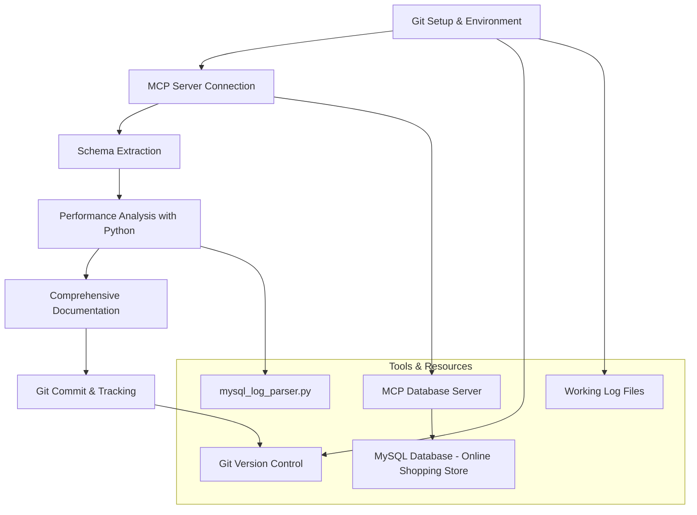

# MySQL Analysis - Design

## Overview

The MySQL Analysis stage implements a systematic approach to database schema extraction and performance analysis for the online shopping store application. The design follows a 4-phase approach: environment setup with Git version control, schema extraction using MCP servers, performance analysis using existing Python tools, and comprehensive documentation generation. This stage focuses on understanding the current MySQL database structure and access patterns without suggesting DynamoDB solutions.

## Architecture

### Analysis Workflow



## Components and Interfaces

### 1. Git Version Control Setup
**Purpose**: Establish proper version control and working environment for tracking migration analysis progress
**Implementation**:
- Initialize Git repository at workspace root
- Create comprehensive .gitignore for Node.js/TypeScript projects
- Set up artifacts/ directory for analysis outputs
- Create working log files for progress tracking
- Use git -P flag for non-interactive operations

**Key Features**:
- Track source code changes while excluding build artifacts
- Maintain clean commit history with meaningful messages
- Enable rollback capabilities for analysis iterations
- Document progress in working log files

### 2. MCP Database Connectivity
**Purpose**: Direct SQL execution for schema extraction using simplified MCP server
**Tools**: 
- `execute_sql`: Execute SQL queries directly on the MySQL server

**Key Features**:
- Pre-configured connection to the online shopping store database
- Direct SQL query execution for schema extraction
- No complex connection management needed
- Requires writing specific SQL queries for schema analysis

**SQL Queries for Schema Extraction**:
```sql
-- Get all tables in the database
SHOW TABLES;

-- Get detailed table structure
DESCRIBE users;
DESCRIBE products;
DESCRIBE categories;
DESCRIBE orders;
DESCRIBE order_items;

-- Get foreign key relationships
SELECT 
    TABLE_NAME,
    COLUMN_NAME,
    CONSTRAINT_NAME,
    REFERENCED_TABLE_NAME,
    REFERENCED_COLUMN_NAME
FROM INFORMATION_SCHEMA.KEY_COLUMN_USAGE
WHERE REFERENCED_TABLE_SCHEMA = DATABASE()
    AND REFERENCED_TABLE_NAME IS NOT NULL;

-- Get indexes information
SELECT 
    TABLE_NAME,
    INDEX_NAME,
    COLUMN_NAME,
    NON_UNIQUE
FROM INFORMATION_SCHEMA.STATISTICS
WHERE TABLE_SCHEMA = DATABASE()
ORDER BY TABLE_NAME, INDEX_NAME, SEQ_IN_INDEX;

-- Get constraints
SELECT 
    TABLE_NAME,
    CONSTRAINT_NAME,
    CONSTRAINT_TYPE
FROM INFORMATION_SCHEMA.TABLE_CONSTRAINTS
WHERE TABLE_SCHEMA = DATABASE();
```

### 3. Schema Analysis Engine
**Purpose**: Comprehensive analysis of the online shopping store MySQL database structure
**Methodology**:
- Extract all table definitions for users, products, categories, orders, order_items, and shopping_cart tables
- Identify and map all relationships specific to e-commerce domain (1:1, 1:M, M:N)
- Document indexes, constraints, and referential integrity for the shopping application
- Analyze data types and size estimations for e-commerce entities

**Expected E-commerce Schema Structure**:
```markdown
# Online Shopping Store - MySQL Schema Analysis
## Core Tables
### users
- Columns: id, email, password_hash, first_name, last_name, is_seller, created_at, updated_at
- Primary Key: id
- Unique Constraints: email
- Relationships: One-to-Many with orders, products (if seller)

### products
- Columns: id, name, description, price, stock_quantity, category_id, seller_id, created_at, updated_at
- Primary Key: id
- Foreign Keys: category_id → categories(id), seller_id → users(id)
- Indexes: category_id, seller_id

### categories
- Columns: id, name, description, created_at, updated_at
- Primary Key: id
- Relationships: One-to-Many with products

### orders
- Columns: id, user_id, total_amount, status, created_at, updated_at
- Primary Key: id
- Foreign Keys: user_id → users(id)
- Relationships: One-to-Many with order_items

### order_items
- Columns: id, order_id, product_id, quantity, price_at_time, created_at
- Primary Key: id
- Foreign Keys: order_id → orders(id), product_id → products(id)
- Composite Indexes: (order_id, product_id)
```

### 4. Performance Analysis Engine
**Purpose**: Analyze query patterns and performance metrics using the existing mysql_log_parser.py script
**Methodology**:
- **Use Existing Tool**: Leverage the mysql_log_parser.py script from the database/ folder
- Process MySQL general logs to identify application vs system queries
- Calculate frequency metrics, throughput, and query type distribution
- Identify access patterns specific to the e-commerce application workload

**Expected E-commerce Access Patterns**:
```python
# E-commerce Access Patterns Structure
{
    "access_patterns": [
        {
            "pattern_id": "AP1",
            "description": "User authentication and profile lookup",
            "operation_type": "READ",
            "query_example": "SELECT * FROM users WHERE email = ?",
            "frequency_rps": "High during login periods",
            "entities_involved": ["users"],
            "complexity": "SIMPLE"
        },
        {
            "pattern_id": "AP2", 
            "description": "Product catalog browsing with category filtering",
            "operation_type": "READ",
            "query_example": "SELECT p.*, c.name FROM products p JOIN categories c ON p.category_id = c.id WHERE c.id = ?",
            "frequency_rps": "Very High - main application flow",
            "entities_involved": ["products", "categories"],
            "complexity": "MODERATE"
        },
        {
            "pattern_id": "AP3",
            "description": "Order creation and order items insertion",
            "operation_type": "WRITE",
            "query_example": "INSERT INTO orders... / INSERT INTO order_items...",
            "frequency_rps": "Medium - transactional",
            "entities_involved": ["orders", "order_items", "products"],
            "complexity": "COMPLEX"
        }
    ]
}
```

**Analysis Process**:
1. Run mysql_log_parser.py on available MySQL logs
2. Extract query statistics and patterns
3. Classify queries by e-commerce business function
4. Identify read vs write patterns for each entity
5. Document throughput and frequency characteristics

### 5. Comprehensive Documentation Framework
**Purpose**: Generate complete analysis documentation combining schema and performance insights
**Documentation Structure**:
- **Entity Relationship Analysis**: Detailed explanation of how e-commerce entities relate
- **Table Structure Documentation**: Complete column definitions, constraints, and indexes
- **Access Pattern Documentation**: Specific patterns identified from the shopping application
- **Performance Characteristics**: Throughput, frequency, and complexity analysis
- **Foundation for Next Stage**: Prepare information for DynamoDB data modeling without suggesting solutions

**Modular Artifact Structure**:
```
artifacts/
├── stage-00/
│   └── 00_0_working_log.md           # Git setup and progress tracking
└── stage-01/
    ├── 01_1_working_log.md           # API analysis progress tracking
    ├── 01_1_API_access_patterns.md   # Backend API endpoints and access patterns
    ├── 01_2_working_log.md           # Database analysis progress tracking
    ├── 01_2_schema_extraction.md     # Raw schema data from SQL queries
    ├── 01_3_entity_relationships.md  # E-commerce entity relationship analysis
    ├── 01_4_table_structures.md      # Detailed table definitions and constraints
    ├── 01_5_performance_analysis.md  # mysql_log_parser.py results
    ├── 01_6_access_patterns.md       # Identified access patterns from logs
    └── 01_summary_analysis.md        # Summary and next steps (optional)
```

**Benefits of Modular Approach**:
- **Focused Content**: Each artifact addresses a specific aspect of the analysis
- **Easy Reference**: Future stages can reference specific artifacts without parsing large documents
- **Progress Tracking**: Clear visibility into what has been completed
- **Reusability**: Individual artifacts can be used independently
- **Maintainability**: Updates to specific areas don't affect other components
- **Parallel Work**: Different aspects can be worked on independently
- **Scalable Naming**: Stage-based folders with leading zeros support multi-digit stages (01, 02, ..., 10, 11, etc.)
- **Organized Structure**: Each stage has its own subfolder preventing artifact conflicts between stages

**Artifact Content Guidelines**:
- **API Access Patterns**: Backend API endpoints, routes, and application-level access patterns from code analysis
- **Schema Extraction**: Raw SQL query results and table definitions
- **Entity Relationships**: Business logic relationships between e-commerce entities
- **Table Structures**: Detailed column definitions, constraints, and indexes
- **Performance Analysis**: Direct output from mysql_log_parser.py
- **Access Patterns**: Interpreted patterns from performance data
- **Summary**: High-level findings and recommendations for next stage (if needed)

## Data Models

### MySQL Schema Representation
```python
@dataclass
class MySQLSchema:
    tables: List[TableDefinition]
    relationships: List[Relationship]
    constraints: List[Constraint]
    indexes: List[Index]
    performance_metrics: PerformanceAnalysis
    context_assessment: ContextAssessment
```

### Access Pattern Documentation
```python
@dataclass
class AccessPattern:
    pattern_id: str
    description: str
    operation_type: str  # READ, WRITE, UPDATE, DELETE
    frequency_rps: float
    entities_involved: List[str]
    query_complexity: str  # SIMPLE, MODERATE, COMPLEX
    consistency_requirements: str  # EVENTUAL, STRONG
    dynamodb_suitability: str  # HIGH, MEDIUM, LOW, UNSUITABLE
```

## Error Handling

### Connection Errors
- MCP server connectivity issues
- MySQL authentication failures
- Network timeout handling
- Connection pool management

### Analysis Errors
- Incomplete schema extraction
- Performance log parsing failures
- Missing or corrupted data
- Insufficient permissions

### Recovery Procedures
- Retry mechanisms with exponential backoff
- Partial analysis completion and resumption
- Alternative analysis approaches for missing data
- Clear error reporting and troubleshooting guidance

## Validation and Quality Assurance

### Schema Validation
- Verify all tables are extracted
- Confirm relationship mappings are complete
- Validate constraint documentation
- Check for missing or incomplete information

### Performance Analysis Validation
- Verify RPS calculations are reasonable
- Confirm access pattern identification is complete
- Validate query complexity assessments
- Check for missing or edge case patterns

### Output Quality Checks
- Ensure `Stage1_MySQLAnalysis.md` is complete and well-formatted
- Verify all required sections are present
- Confirm recommendations are actionable
- Validate that output can be consumed by subsequent stages