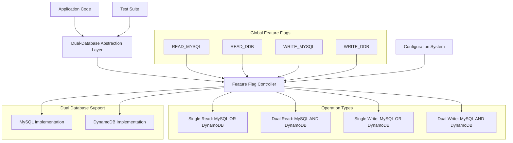

# Dual-Database Abstraction - Design

## Overview

The Dual-Database Abstraction stage implements a discovery-driven approach to introduce a dual-database layer in the backend application's Data Access Layer. This stage focuses exclusively on the backend/ folder - no frontend modifications are required. The approach first explores the actual backend codebase to understand its structure, then generates tailored requirements and design specifications, and finally implements the abstraction layer. This ensures the solution fits the actual codebase rather than making assumptions about its structure.

## Architecture

### Dual-Database Architecture with Global Feature Flags



## Components and Interfaces

### 1. Discovery-Driven Backend Analysis Engine
**Purpose**: Comprehensive exploration and analysis of the actual backend codebase to understand its structure and generate appropriate requirements (backend/ folder only)

**Critical Methodology**:
- **Test-First Approach**: Run all tests before starting, verify passing baseline
- **No Framework Introduction**: Don't introduce new languages/frameworks (e.g., no TypeScript in JavaScript project)
- **Convention Preservation**: Match existing naming conventions (CamelCase vs snake_case vs lowerCamelCase)

**Discovery-Driven Analysis Process**:
1. **Codebase Exploration**: Read and analyze backend structure, dependencies, and architecture
2. **Data Access Pattern Discovery**: Identify actual repositories, services, and data access patterns used
3. **Test Framework Analysis**: Understand existing test structure and patterns
4. **Requirements Generation**: Create specific requirements based on discovered architecture
5. **Design Specification**: Generate tailored design that fits the actual codebase
6. **Implementation Planning**: Create step-by-step plan respecting existing patterns

**Key Benefits**:
- **Accurate Fit**: Solution matches actual codebase structure rather than assumptions
- **Preserved Conventions**: Respects existing naming, patterns, and architectural decisions
- **Minimal Disruption**: Works with existing code rather than forcing new patterns
- **SCOPE**: Focus exclusively on backend/ folder - ignore frontend/ folder completely

### 2. Dual-Database Interface Design System
**Purpose**: Create backend interfaces that support simultaneous MySQL and DynamoDB operations with global feature flag control

**Abstraction Layer Focus**:
- **Interface Definition**: This stage focuses on creating the dual-database interfaces and abstraction layer
- **MySQL Implementation**: Implement concrete MySQL repositories that satisfy the interfaces
- **DynamoDB Placeholder**: Create placeholder/stub DynamoDB repositories (actual implementation happens in stage 04)
- **Feature Flag Infrastructure**: Set up the feature flag system and dual-database routing logic

**Migration Scenarios Enabled**:
1. **MySQL Only**: READ_MYSQL=true, WRITE_MYSQL=true (current state)
2. **Dual Write**: READ_MYSQL=true, WRITE_MYSQL=true, WRITE_DDB=true (write to both, read from MySQL)
3. **Dual Read/Write**: READ_MYSQL=true, READ_DDB=true, WRITE_MYSQL=true, WRITE_DDB=true (full dual operation)
4. **DynamoDB Primary**: READ_DDB=true, WRITE_DDB=true, WRITE_MYSQL=true (read from DDB, write to both)
5. **DynamoDB Only**: READ_DDB=true, WRITE_DDB=true (final migration state)

**Dual-Database Design Principles**:
- **Global Flag Control**: All read/write operations controlled by global feature flags (READ_MYSQL, READ_DDB, WRITE_MYSQL, WRITE_DDB)
- **Dual Operations Support**: Support reading from BOTH databases simultaneously (for comparison/validation) and writing to BOTH databases simultaneously (for migration)
- **Simultaneous Connections**: Support active connections to both MySQL and DynamoDB simultaneously
- **Transparent Operation**: Application code remains unchanged - flags control database routing at the DAL level
- **Consistent Interface**: Same interface supports both databases with flag-based routing
- **Migration Support**: Enable gradual migration scenarios (read from old, write to both, read from both, etc.)

**Discovery Artifacts Structure**:
```
artifacts/
└── stage-03/
    ├── 03_1_backend_analysis.md      # Comprehensive backend codebase analysis
    ├── 03_2_data_access_analysis.md  # Data access patterns and test structure
    ├── 03_3_dal_requirements.md      # Generated requirements based on discovery
    ├── 03_4_dal_design.md           # Tailored design specification
    ├── 03_5_implementation_log.md    # Implementation progress and notes
    └── 03_6_validation_results.md    # Test results and validation outcomes
```

**Dual-Database Interface Example** (will be based on actual backend discovery):
```typescript
// Feature flag configuration
interface FeatureFlags {
    READ_MYSQL: boolean;
    READ_DDB: boolean;
    WRITE_MYSQL: boolean;
    WRITE_DDB: boolean;
}

// Dual-database repository interface
interface IUserRepository {
    findById(id: number): Promise<User>;        // Reads from database(s) based on READ flags
    findByEmail(email: string): Promise<User>;  // Reads from database(s) based on read flags
    create(user: User): Promise<User>;          // Writes to database(s) based on write flags
    update(user: User): Promise<User>;          // Writes to database(s) based on write flags
    delete(id: number): Promise<void>;          // Writes to database(s) based on write flags
}

// Implementation handles flag-based routing with dual operation support
class DualDatabaseUserRepository implements IUserRepository {
    constructor(
        private mysqlRepo: MySQLUserRepository,
        private dynamoRepo: IDynamoDBUserRepository,  // Interface only - implementation in stage 04
        private flags: FeatureFlags
    ) {}
    
    async findById(id: number): Promise<User> {
        const readFromMySQL = this.flags.READ_MYSQL;
        const readFromDDB = this.flags.READ_DDB;
        
        if (readFromMySQL && readFromDDB) {
            // DUAL READ: Read from both databases
            const [mysqlResult, ddbResult] = await Promise.all([
                this.mysqlRepo.findById(id),
                this.dynamoRepo.findById(id)
            ]);
            
            // Log comparison for validation (optional)
            this.compareResults('findById', mysqlResult, ddbResult);
            
            // Return primary result (could be configurable)
            return mysqlResult; // or ddbResult based on migration phase
        } else if (readFromMySQL) {
            return this.mysqlRepo.findById(id);
        } else if (readFromDDB) {
            return this.dynamoRepo.findById(id);
        }
        
        throw new Error('No read database configured');
    }
    
    async create(user: User): Promise<User> {
        const writeToMySQL = this.flags.WRITE_MYSQL;
        const writeToDDB = this.flags.WRITE_DDB;
        
        if (writeToMySQL && writeToDDB) {
            // DUAL WRITE: Write to both databases
            const [mysqlResult, ddbResult] = await Promise.all([
                this.mysqlRepo.create(user),
                this.dynamoRepo.create(user)  // DynamoDB implementation will be added in stage 04
            ]);
            
            // Return primary result (could be configurable)
            return mysqlResult; // or ddbResult based on migration phase
        } else if (writeToMySQL) {
            return this.mysqlRepo.create(user);
        } else if (writeToDDB) {
            return this.dynamoRepo.create(user);  // DynamoDB implementation will be added in stage 04
        }
        
        throw new Error('No write database configured');
    }
    
    private compareResults(operation: string, mysqlResult: any, ddbResult: any): void {
        // Log differences for validation during migration
        // This helps ensure data consistency between databases
        if (JSON.stringify(mysqlResult) !== JSON.stringify(ddbResult)) {
            console.warn(`Data mismatch in ${operation}:`, { mysqlResult, ddbResult });
        }
    }
}
```

### 3. Concrete Implementation System
**Purpose**: Implement concrete classes for the current data store

**Implementation Requirements**:
- Create implementation classes that fully satisfy interface contracts
- Preserve existing implementation behavior exactly
- Implement consistent error handling across implementations
- **CRITICAL**: Do NOT change existing test or implementation code at this stage
- Re-run tests after this stage and fix any errors WITHOUT changing original code

**Example Implementation**:
```typescript
class MySQLWorkspaceRepository implements IWorkspaceRepository {
    constructor(private connection: MySQLConnection) {}
    
    async findById(id: string): Promise<Workspace> {
        // Exact same logic as original implementation
        // No changes to behavior, just wrapped in interface
    }
    
    // ... other methods preserving exact original behavior
}
```

### 4. Dual-Database Factory Pattern Implementation
**Purpose**: Instantiate dual-database repositories that support both MySQL and DynamoDB simultaneously

**Dual-Database Factory Requirements**:
- Create repositories that connect to BOTH MySQL and DynamoDB
- Handle feature flag configuration injection
- Support runtime flag switching without recreating connections
- Provide connection pooling for both databases

**Dual-Database Factory Design**:
```typescript
interface IRepositoryFactory {
    createUserRepository(): IUserRepository;
    createProductRepository(): IProductRepository;
    createOrderRepository(): IOrderRepository;
    // ... other repositories based on backend discovery
}

class DualDatabaseRepositoryFactory implements IRepositoryFactory {
    constructor(
        private mysqlConnection: MySQLConnection,
        private dynamodbClient: DynamoDBClient,  // Client setup, actual repos implemented in stage 04
        private featureFlags: FeatureFlags
    ) {}
    
    createUserRepository(): IUserRepository {
        const mysqlRepo = new MySQLUserRepository(this.mysqlConnection);
        const dynamoRepo = new StubDynamoDBUserRepository();  // Stub implementation - real one in stage 04
        
        return new DualDatabaseUserRepository(
            mysqlRepo,
            dynamoRepo,
            this.featureFlags
        );
    }
    
    createProductRepository(): IProductRepository {
        const mysqlRepo = new MySQLProductRepository(this.mysqlConnection);
        const dynamoRepo = new DynamoDBProductRepository(this.dynamodbClient);
        
        return new DualDatabaseProductRepository(
            mysqlRepo,
            dynamoRepo,
            this.featureFlags
        );
    }
    
    // Feature flag updates affect all repositories
    updateFeatureFlags(newFlags: FeatureFlags): void {
        this.featureFlags = newFlags;
        // All existing repository instances will use updated flags
    }
}
```

### 5. Dual-Database Configuration Management System
**Purpose**: Create configuration system to manage both MySQL and DynamoDB connections with feature flags

**Dual-Database Configuration Requirements**:
- Define configuration structure supporting BOTH MySQL and DynamoDB simultaneously
- Include feature flag configuration for controlling read/write operations
- Create separate configurations for different environments and migration phases
- Support runtime feature flag updates without restarting the application

**Dual-Database Configuration Example**:
```json
{
  "database": {
    "mysql": {
      "host": "localhost",
      "port": 3306,
      "database": "online_shopping_store",
      "username": "user",
      "password": "password"
    },
    "dynamodb": {
      "region": "us-west-2",
      "endpoint": "http://localhost:8000"
    }
  },
  "featureFlags": {
    "READ_MYSQL": true,
    "READ_DDB": false,
    "WRITE_MYSQL": true,
    "WRITE_DDB": false
  },
  "migration": {
    "contractPath": "./migrationContract.json",  // Will be used in stage 04 for DynamoDB implementation
    "phase": "mysql-only",
    "enableComparison": false,
    "logDifferences": true
  }
}
```

**Migration Phase Configurations**:
```json
// Phase 1: MySQL Only
{"READ_MYSQL": true, "READ_DDB": false, "WRITE_MYSQL": true, "WRITE_DDB": false}

// Phase 2: Dual Write (write to both, read from MySQL)
{"READ_MYSQL": true, "READ_DDB": false, "WRITE_MYSQL": true, "WRITE_DDB": true}

// Phase 3: Dual Read/Write (full dual operation for validation)
{"READ_MYSQL": true, "READ_DDB": true, "WRITE_MYSQL": true, "WRITE_DDB": true}

// Phase 4: DynamoDB Primary (read from DDB, write to both)
{"READ_MYSQL": false, "READ_DDB": true, "WRITE_MYSQL": true, "WRITE_DDB": true}

// Phase 5: DynamoDB Only
{"READ_MYSQL": false, "READ_DDB": true, "WRITE_MYSQL": false, "WRITE_DDB": true}
```

### 5. Application Integration System
**Purpose**: Integrate the abstraction layer with existing application code

**Integration Requirements**:
- Maintain existing DI patterns if dependency injection is used
- Support configuration-based selection of implementations
- Handle initialization properly
- Avoid changes to existing code outside the DAL where possible
- Suggest improvements that reduce coupling between application and DAL

### 6. Test Suite Adaptation System
**Purpose**: Ensure all tests work with the new abstraction layer

**Testing Requirements**:
- Maintain existing test coverage
- Verify consistent behavior across implementations
- **CRITICAL**: Do NOT alter test setup logic for current implementations, only adapt to use factory pattern
- Refactor tests to reduce coupling between test logic and concrete DAL implementation
- Test configuration switching and error scenarios
- Run same test code against all implementations

**Test Adaptation Example**:
```typescript
// Before: Direct dependency on concrete class
describe('WorkspaceService', () => {
    let workspaceRepo: MySQLWorkspaceRepository;
    
    beforeEach(() => {
        workspaceRepo = new MySQLWorkspaceRepository(connection);
    });
});

// After: Using factory pattern
describe('WorkspaceService', () => {
    let workspaceRepo: IWorkspaceRepository;
    
    beforeEach(() => {
        const factory = new RepositoryFactory(testConfig);
        workspaceRepo = factory.createWorkspaceRepository();
    });
});
```

### 7. Configuration Management System
**Purpose**: Create configuration system to select appropriate implementation

**Configuration Requirements**:
- Define configuration structure supporting all implementations
- Create separate configurations for different environments
- Document configuration options clearly
- Support environment-specific overrides

**Configuration Example**:
```json
{
  "database": {
    "type": "mysql",
    "mysql": {
      "host": "localhost",
      "port": 3306,
      "database": "myapp",
      "username": "user",
      "password": "password"
    },
    "dynamodb": {
      "region": "us-west-2",
      "endpoint": "http://localhost:8000"
    }
  }
}
```

## Data Models

### Repository Interface Pattern
```typescript
interface IRepository<T, ID> {
    findById(id: ID): Promise<T | null>;
    findAll(): Promise<T[]>;
    create(entity: T): Promise<T>;
    update(entity: T): Promise<T>;
    delete(id: ID): Promise<void>;
}
```

### Factory Configuration
```typescript
interface DatabaseConfig {
    type: 'mysql' | 'dynamodb';
    mysql?: MySQLConfig;
    dynamodb?: DynamoDBConfig;
    pooling?: PoolingConfig;
    timeout?: number;
}
```

## Error Handling

### Configuration Errors
- Invalid database type selection
- Missing required configuration parameters
- Connection failures during initialization
- Runtime switching failures

### Implementation Errors
- Interface contract violations
- Inconsistent behavior across implementations
- Transaction handling differences
- Error propagation inconsistencies

### Test Failures
- Broken existing functionality
- Inconsistent test results across implementations
- Configuration-specific test failures
- Performance regression issues

## Validation and Quality Assurance

### Implementation Validation
- Verify all existing tests pass with new implementation
- Confirm error handling is consistent across implementations
- Validate configuration management works correctly
- Ensure logging is consistent across implementations

### Test Coverage Validation
- Maintain or improve existing test coverage percentages
- Verify all implementations are tested with same test suite
- Confirm configuration switching is properly tested
- Validate error scenarios are adequately covered

### Documentation Requirements
- Update documentation to reflect new abstraction layer
- Document configuration options and environment setup
- Provide examples of adding new implementations
- Include troubleshooting guide for common issues