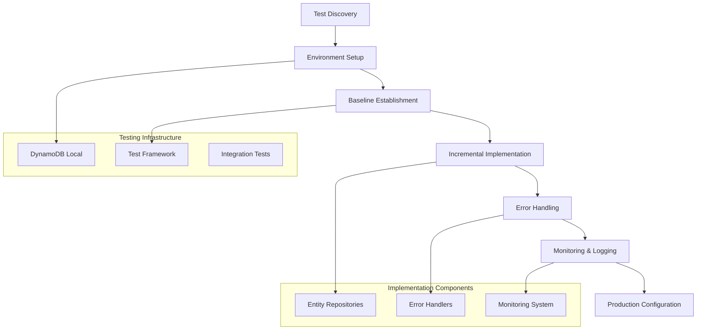

# DynamoDB Implementation - Design

## Overview

The DynamoDB Implementation stage follows a rigorous test-driven development approach to create a complete DynamoDB data access layer using the migrationContract.json specifications. The design emphasizes incremental implementation, comprehensive error handling, and production-ready configuration while maintaining strict compatibility with the existing abstraction layer.

## Architecture

### Implementation Architecture



## Components and Interfaces

### 1. Stage 03 Artifact Integration System
**Purpose**: Reuse and build upon the dual-database abstraction artifacts from stage 03

**Artifact Reuse Strategy**:
- **Backend Analysis Reuse**: Use `artifacts/stage-03/03_1_backend_analysis.md` for programming language, framework, and architecture understanding
- **Data Access Pattern Reuse**: Use `artifacts/stage-03/03_2_data_access_analysis.md` for repository patterns and test structure
- **Interface Definitions**: Use the interfaces defined in stage 03 artifacts - do not redefine or modify them
- **Configuration Reuse**: Build upon the dual-database configuration established in stage 03
- **Stub Replacement**: Replace stub DynamoDB implementations with real ones without changing interface contracts

**Implementation Plan Generation**:
- **Migration Contract**: Use `migrationContract.json` for exact table names, attribute mappings, and data transformations
- **Data Model Context**: Use `dynamodb_data_model.md` to understand design philosophy, trade-offs, and rationale behind decisions
- **Interface Mapping**: Cross-reference migration contract with stage 03 interface definitions
- **Transformation Logic**: Generate detailed transformation specifications based on contract and data model reasoning
- **Method Specifications**: Document exact method-by-method implementation requirements with context

**Stage 04 Artifact Structure**:
```
artifacts/
├── stage-02/                           # REFERENCE: Data modeling context
│   ├── dynamodb_data_model.md          # Design philosophy, trade-offs, rationale
│   └── migrationContract.json          # Exact implementation specifications
├── stage-03/                           # REUSE: Artifacts from previous stage
│   ├── 03_1_backend_analysis.md        # Programming language, frameworks, architecture
│   ├── 03_2_data_access_analysis.md    # Repository patterns, test structure
│   ├── 03_3_dal_requirements.md        # Dual-database requirements
│   ├── 03_4_dal_design.md             # Interface definitions and design
│   └── 03_5_implementation_log.md      # Stage 03 implementation progress
└── stage-04/                           # NEW: Stage 04 specific artifacts
    ├── 04_1_implementation_plan.md     # Detailed coding specifications
    ├── 04_2_implementation_log.md      # Implementation progress tracking
    └── 04_3_validation_results.md      # Final validation and test results
```

### 2. Test Environment Management System
**Purpose**: Establish and maintain proper testing infrastructure building on stage 03 setup

**Critical Methodology**:
- **⚠️ CRITICAL TEST GATE**: Must run tests before ANY code changes and after EVERY substantive change
- **No Mock Testing**: Must use real DynamoDB Local, no mock data or mock tests
- **Test-Driven Development**: Write failing test → implement minimum code → run tests → refactor → repeat

**Environment Requirements**:
- Identify testing framework and commands used in repository
- Run DynamoDB Local via Docker for testing
- Verify test environment is properly configured
- Document test execution procedures specific to this repository

**Test Discovery Process**:
```bash
# Example test discovery commands
npm test                    # Node.js projects
python -m pytest          # Python projects
mvn test                   # Java Maven projects
gradle test                # Java Gradle projects
```

### 3. Migration Contract Integration System
**Purpose**: Use migrationContract.json and dynamodb_data_model.md to guide all DynamoDB implementation decisions

**Migration Contract Usage**:
- **Table Mapping**: Use contract to determine which DynamoDB table corresponds to each MySQL table
- **Attribute Transformation**: Use contract attribute mappings to transform data between MySQL and DynamoDB formats
- **Key Structure**: Use contract to determine partition key, sort key, and GSI key structures
- **Data Types**: Use contract type mappings (S, N, B) for proper DynamoDB attribute types
- **Denormalization**: Handle denormalized attributes as specified in the contract with proper justifications

**Data Model Context Integration**:
- **Design Philosophy**: Understand the overall approach (multi-table vs single-table, natural keys, etc.)
- **Trade-off Rationale**: Understand why specific design decisions were made (performance vs cost vs complexity)
- **Access Pattern Mapping**: Understand how each access pattern maps to DynamoDB operations
- **Cost Considerations**: Understand RCU/WCU estimates and optimization decisions
- **Hot Partition Analysis**: Understand partition distribution strategies and mitigation approaches

**Contract Structure Reference**:
```json
{
  "table": "Users",
  "type": "Table", 
  "source_table": "users",
  "pk": "UserId",
  "attributes": {
    "UserId": {
      "type": "N",
      "source_table": "users", 
      "source_column": "id"
    },
    "Email": {
      "type": "S",
      "source_table": "users",
      "source_column": "email"
    }
  },
  "satisfies": ["Get user by ID", "Get user by email"],
  "estimated_item_size_bytes": 200
}
```

### 4. Incremental Implementation Engine
**Purpose**: Systematic implementation of DynamoDB operations following migration contract specifications with data model context

**Implementation Approach**:
1. **Write a failing test for the feature**
2. **Implement the minimum code to make the test pass**
3. **Run the test suite to verify**
4. **Refactor while keeping tests passing**
5. **Repeat for each feature**

**Critical Requirements**:
- **Migration Contract Compliance**: Follow migrationContract.json specifications exactly for table names, attribute mappings, and data transformations
- **Data Transformation**: Use the migration contract to transform MySQL data structures to DynamoDB format
- **MySQL ID Preservation**: Keep MySQL-generated IDs in same format, cast to DynamoDB type as specified in the contract
- **Language Consistency**: Use exact same programming language version as existing repository
- **Convention Matching**: Write code that matches existing repository conventions

**Implementation Pattern**:
```typescript
// Example DynamoDB Repository Implementation using Migration Contract
class DynamoDBUserRepository implements IUserRepository {
    constructor(
        private dynamoClient: DynamoDBClient,
        private migrationContract: MigrationContract,
        private logger: Logger
    ) {}
    
    async findById(id: number): Promise<User | null> {
        try {
            // Use migration contract to get table name and key structure
            const tableConfig = this.migrationContract.getTableConfig('users');
            
            const command = new GetItemCommand({
                TableName: tableConfig.tableName,  // From migration contract
                Key: {
                    [tableConfig.partitionKey]: { N: id.toString() }  // Contract specifies key format
                }
            });
            
            const result = await this.dynamoClient.send(command);
            return result.Item ? this.transformDynamoItemToUser(result.Item) : null;
        } catch (error) {
            this.logger.error('Error finding user by ID', { id, error });
            throw this.handleDynamoError(error);
        }
    }
    
    private transformDynamoItemToUser(item: Record<string, AttributeValue>): User {
        // Use migration contract to transform DynamoDB item back to User object
        // The data model documentation explains why certain transformations were chosen
        return this.migrationContract.transformFromDynamoDB('users', item);
    }
    
    // ... other methods following same pattern
}
```

### 3. Error Handling and Retry System
**Purpose**: Comprehensive error handling for production reliability

**Error Handling Requirements**:
- Handle provisioned throughput exceeded exceptions with exponential backoff
- Handle conditional check failures appropriately
- Implement idempotent operations where possible
- Log detailed error information for troubleshooting

**Retry Strategy Implementation**:
```typescript
class DynamoDBErrorHandler {
    async executeWithRetry<T>(
        operation: () => Promise<T>,
        maxRetries: number = 3
    ): Promise<T> {
        let lastError: Error;
        
        for (let attempt = 0; attempt <= maxRetries; attempt++) {
            try {
                return await operation();
            } catch (error) {
                lastError = error;
                
                if (this.isRetryableError(error) && attempt < maxRetries) {
                    const delay = this.calculateBackoffDelay(attempt);
                    await this.sleep(delay);
                    continue;
                }
                
                throw error;
            }
        }
        
        throw lastError!;
    }
    
    private isRetryableError(error: any): boolean {
        return error.name === 'ProvisionedThroughputExceededException' ||
               error.name === 'ThrottlingException' ||
               error.name === 'ServiceUnavailableException';
    }
    
    private calculateBackoffDelay(attempt: number): number {
        return Math.min(1000 * Math.pow(2, attempt), 30000); // Max 30 seconds
    }
}
```

### 4. Monitoring and Logging System
**Purpose**: Production-ready observability and debugging capabilities

**Monitoring Requirements**:
- Log all database operations with correlation IDs
- Track operation latency and error rates
- Configure CloudWatch metrics for DynamoDB tables
- Set up alarms for throughput limits and errors

**Logging Implementation**:
```typescript
interface DynamoDBOperationLog {
    operation: string;
    tableName: string;
    key: Record<string, any>;
    duration: number;
    success: boolean;
    error?: string;
    correlationId: string;
}

class DynamoDBLogger {
    logOperation(log: DynamoDBOperationLog): void {
        const logLevel = log.success ? 'info' : 'error';
        this.logger[logLevel]('DynamoDB Operation', {
            ...log,
            timestamp: new Date().toISOString()
        });
    }
    
    logPerformanceMetric(operation: string, duration: number): void {
        // Send to CloudWatch or other monitoring system
        this.metricsClient.putMetric({
            MetricName: 'DynamoDBOperationDuration',
            Value: duration,
            Unit: 'Milliseconds',
            Dimensions: [
                { Name: 'Operation', Value: operation }
            ]
        });
    }
}
```

### 5. Production Configuration System
**Purpose**: Optimize SDK configuration for production deployment

**Configuration Requirements**:
- Use SDK defaults whenever settings are not overridden
- Prefer default credential provider for credential management
- Ensure production configuration does not use DynamoDB Local
- Support environment-specific configuration overrides

**Configuration Design**:
```typescript
interface DynamoDBConfig {
    region?: string;
    endpoint?: string; // Only for local development
    credentials?: {
        accessKeyId?: string;
        secretAccessKey?: string;
    };
    maxRetries?: number;
    timeout?: number;
}

class DynamoDBConfigManager {
    createClient(config: DynamoDBConfig): DynamoDBClient {
        const clientConfig: DynamoDBClientConfig = {
            region: config.region || process.env.AWS_REGION || 'us-west-2'
        };
        
        // Only set endpoint for local development
        if (process.env.NODE_ENV === 'development' && config.endpoint) {
            clientConfig.endpoint = config.endpoint;
        }
        
        // Use default credential provider unless explicitly overridden
        if (config.credentials) {
            clientConfig.credentials = config.credentials;
        }
        
        return new DynamoDBClient(clientConfig);
    }
}
```

## Data Models

### DynamoDB Operation Result
```typescript
interface DynamoDBOperationResult<T> {
    success: boolean;
    data?: T;
    error?: DynamoDBError;
    metadata: {
        consumedCapacity?: number;
        requestId: string;
        duration: number;
    };
}
```

### Error Classification
```typescript
enum DynamoDBErrorType {
    THROTTLING = 'THROTTLING',
    CONDITIONAL_CHECK_FAILED = 'CONDITIONAL_CHECK_FAILED',
    ITEM_NOT_FOUND = 'ITEM_NOT_FOUND',
    VALIDATION_ERROR = 'VALIDATION_ERROR',
    SERVICE_ERROR = 'SERVICE_ERROR'
}

interface DynamoDBError {
    type: DynamoDBErrorType;
    message: string;
    retryable: boolean;
    originalError: any;
}
```

## Error Handling

### Error Categories and Responses

1. **Throttling Errors**: Implement exponential backoff with jitter
2. **Conditional Check Failures**: Return appropriate business logic errors
3. **Item Not Found**: Handle gracefully based on operation context
4. **Validation Errors**: Provide clear error messages for debugging
5. **Service Errors**: Log detailed information and implement circuit breaker

### Circuit Breaker Pattern
```typescript
class CircuitBreaker {
    private failures = 0;
    private lastFailureTime = 0;
    private state: 'CLOSED' | 'OPEN' | 'HALF_OPEN' = 'CLOSED';
    
    async execute<T>(operation: () => Promise<T>): Promise<T> {
        if (this.state === 'OPEN') {
            if (Date.now() - this.lastFailureTime > this.timeout) {
                this.state = 'HALF_OPEN';
            } else {
                throw new Error('Circuit breaker is OPEN');
            }
        }
        
        try {
            const result = await operation();
            this.onSuccess();
            return result;
        } catch (error) {
            this.onFailure();
            throw error;
        }
    }
}
```

## Testing Strategy

### Dual Testing Approach: Unit + Integration

**Why Both Testing Approaches**:
- **Unit Tests**: Fast feedback, isolated business logic testing, comprehensive edge case coverage
- **Integration Tests**: Real DynamoDB validation, migration contract verification, end-to-end correctness

### Unit Testing Strategy
```typescript
// Example unit test with mocked DynamoDB client
describe('DynamoDBUserRepository Unit Tests', () => {
    let repository: DynamoDBUserRepository;
    let mockDynamoClient: jest.Mocked<DynamoDBClient>;
    
    beforeEach(() => {
        mockDynamoClient = {
            send: jest.fn()
        } as any;
        repository = new DynamoDBUserRepository(mockDynamoClient, migrationContract, logger);
    });
    
    it('should transform user data correctly according to migration contract', async () => {
        // Test data transformation logic without DynamoDB dependency
        const mockDynamoResponse = {
            Item: {
                UserId: { N: '123' },
                Email: { S: 'test@example.com' },
                Username: { S: 'testuser' }
            }
        };
        
        mockDynamoClient.send.mockResolvedValue(mockDynamoResponse);
        
        const result = await repository.findById(123);
        
        expect(result).toEqual({
            id: 123,
            email: 'test@example.com',
            username: 'testuser'
        });
    });
    
    it('should handle DynamoDB errors correctly', async () => {
        mockDynamoClient.send.mockRejectedValue(new Error('ProvisionedThroughputExceededException'));
        
        await expect(repository.findById(123)).rejects.toThrow('Throughput exceeded');
    });
});
```

### Integration Testing with DynamoDB Local
```typescript
// Example integration test with real DynamoDB Local
describe('DynamoDBUserRepository Integration Tests', () => {
    let repository: DynamoDBUserRepository;
    let dynamoClient: DynamoDBClient;
    
    beforeAll(async () => {
        // Connect to DynamoDB Local
        dynamoClient = new DynamoDBClient({
            endpoint: 'http://localhost:8000',
            region: 'us-west-2',
            credentials: {
                accessKeyId: 'dummy',
                secretAccessKey: 'dummy'
            }
        });
        
        repository = new DynamoDBUserRepository(dynamoClient, migrationContract, logger);
        
        // Create test tables based on migration contract
        await createTestTables(dynamoClient, migrationContract);
    });
    
    it('should create and retrieve user following migration contract', async () => {
        const userData = {
            id: 123,
            email: 'test@example.com',
            username: 'testuser'
        };
        
        // Test actual DynamoDB operations
        await repository.create(userData);
        const retrieved = await repository.findById(123);
        
        expect(retrieved).toEqual(userData);
        
        // Verify data is stored correctly in DynamoDB format
        const rawItem = await getRawDynamoItem(dynamoClient, 'Users', { UserId: { N: '123' } });
        expect(rawItem.Email.S).toBe('test@example.com');
    });
    
    it('should handle real DynamoDB throughput limits', async () => {
        // Test with actual DynamoDB Local throttling
        const promises = Array(100).fill(0).map((_, i) => 
            repository.create({ id: i, email: `user${i}@example.com`, username: `user${i}` })
        );
        
        // Should handle throttling gracefully with retries
        await expect(Promise.all(promises)).resolves.not.toThrow();
    });
});
```

### Test File Organization
```
tests/
├── unit/
│   ├── UserRepository.unit.test.js          # Fast business logic tests
│   ├── ProductRepository.unit.test.js       # Mocked DynamoDB client
│   └── OrderRepository.unit.test.js         # Data transformation validation
├── integration/
│   ├── UserRepository.integration.test.js   # Real DynamoDB Local tests
│   ├── ProductRepository.integration.test.js # Migration contract validation
│   └── OrderRepository.integration.test.js  # End-to-end operation tests
└── helpers/
    ├── dynamodb-local-setup.js              # DynamoDB Local test utilities
    ├── test-data-factory.js                 # Test data generation
    └── migration-contract-loader.js         # Contract loading utilities
```

### TDD Workflow with Dual Testing
1. **Write failing unit test** for business logic (fast feedback)
2. **Implement minimum code** to pass unit test
3. **Write failing integration test** with real DynamoDB Local
4. **Implement DynamoDB operations** to pass integration test
5. **Refactor** while keeping both test suites passing
6. **Run all tests** (existing + unit + integration) after each change

### Test Data Management
- **Unit Tests**: Use simple mock data for fast execution
- **Integration Tests**: Use realistic data that matches production patterns
- **Migration Contract Validation**: Verify actual table structures and data formats
- **Edge Cases**: Test boundary conditions in both unit and integration contexts

### Performance Testing
- **Unit Tests**: Test business logic performance without I/O overhead
- **Integration Tests**: Measure actual DynamoDB operation latency
- **Load Testing**: Test throughput limits and throttling with real DynamoDB Local
- **Resource Monitoring**: Validate memory usage and connection management