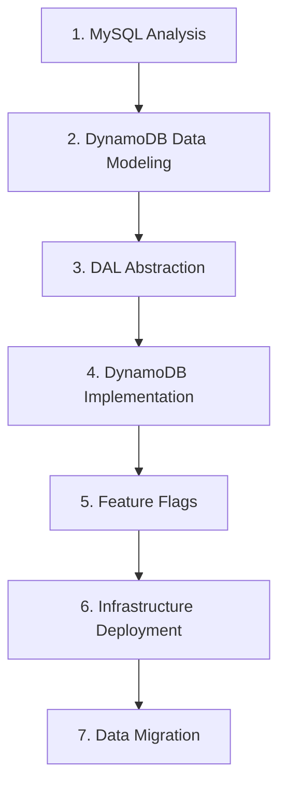

# MySQL to DynamoDB Migration Orchestrator - Design

## Overview

The Migration Orchestrator coordinates the execution of 7 focused migration stages, each implemented as a separate spec. This design ensures Q can focus on one manageable task at a time while maintaining proper dependencies and data flow between stages.

## Architecture

### Stage Dependencies

### Stage Specifications

Each stage is implemented as a complete spec with:
- **requirements.md**: What needs to be achieved and success criteria
- **design.md**: How to achieve it with specific methodologies
- **tasks.md**: Step-by-step executable actions

## Components and Interfaces

### Stage 1: MySQL Analysis
**Spec**: `01-mysql-analysis`
**Purpose**: Extract MySQL schema and analyze access patterns
**Input**: MySQL connection details, application codebase
**Output**: Modular artifacts in `artifacts/stage-01/` (API access patterns, schema extraction, entity relationships, table structures, performance analysis, access patterns)
**Key Methodology**: MCP server connectivity, Python performance analysis

### Stage 2: DynamoDB Data Modeling  
**Spec**: `02-dynamodb-data-modeling`
**Purpose**: Design optimized DynamoDB schema with trade-off analysis
**Input**: Modular artifacts from `artifacts/stage-01/` (API access patterns, schema extraction, entity relationships, table structures, performance analysis, access patterns)
**Output**: `Stage3_DataModel.md`, `migrationContract.json`
**Key Methodology**: Two-file system, RPS documentation, denormalization framework

### Stage 3: DAL Abstraction
**Spec**: `03-dal-abstraction`
**Purpose**: Create abstraction layer for multiple database implementations
**Input**: Application codebase
**Output**: Refactored codebase with DAL abstraction
**Key Methodology**: 9-step process with factory pattern implementation

### Stage 4: DynamoDB Implementation
**Spec**: `04-dynamodb-implementation`
**Purpose**: Implement DynamoDB data access layer
**Input**: `Stage3_DataModel.md`, abstracted codebase
**Output**: Complete DynamoDB implementation with tests
**Key Methodology**: Test-driven development, incremental implementation

### Stage 5: Feature Flags
**Spec**: `05-feature-flags-system`
**Purpose**: Implement dual-read/dual-write with web control interface
**Input**: Completed DAL implementations
**Output**: Feature flag system supporting 5 migration phases
**Key Methodology**: Cookie-based flags, wrapper approach, comprehensive logging

### Stage 6: Infrastructure Deployment
**Spec**: `06-infrastructure-deployment`
**Purpose**: Deploy DynamoDB tables and monitoring
**Input**: `migrationContract.json`
**Output**: Deployed DynamoDB infrastructure
**Key Methodology**: CloudFormation generation, region-specific deployment

### Stage 7: Data Migration
**Spec**: `07-data-migration-execution`
**Purpose**: Execute safe data migration with validation
**Input**: Deployed infrastructure, migration contract
**Output**: Migrated data with validation reports
**Key Methodology**: MySQL views, AWS Glue ETL jobs, comprehensive validation

## Data Flow and Handoffs

### Critical Artifacts

1. **Stage-01 Modular Artifacts**: Complete database analysis in focused artifacts (`artifacts/stage-01/01_1_API_access_patterns.md`, `01_2_schema_extraction.md`, `01_3_entity_relationships.md`, `01_4_table_structures.md`, `01_5_performance_analysis.md`, `01_6_access_patterns.md`)
2. **Stage-02 Modular Artifacts**: dynamodb_data_model.md and dynamodb_requirement.md
3. **migrationContract.json**: MySQL-to-DynamoDB mapping (CRITICAL FORMAT)
4. **Refactored Codebase**: Application with DAL abstraction
5. **Feature Flag System**: Web interface for migration control
6. **CloudFormation Templates**: Infrastructure deployment
7. **Migration Reports**: Validation and completion documentation

### Validation Checkpoints

Each stage must validate:
- Required input artifacts exist and are properly formatted
- Output artifacts are generated in correct format and location
- All tests pass (where applicable)
- Documentation is complete and accurate

## Error Handling

### Stage-Level Recovery
- Each stage includes rollback procedures
- Clear troubleshooting guidance for common issues
- Validation steps to confirm successful completion
- Dependencies verification before proceeding

### Cross-Stage Coordination
- Artifact format validation between stages
- Clear error messages when dependencies are missing
- Guidance for restarting from specific stages
- Comprehensive audit trail maintenance