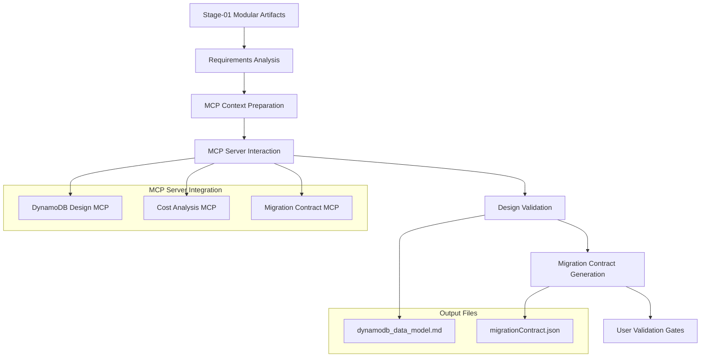

# DynamoDB Data Modeling with MCP Server - Design

## Overview

The DynamoDB Data Modeling with MCP Server stage implements a streamlined approach to transform MySQL schema analysis into an optimized DynamoDB data model by leveraging specialized MCP tools. The design maintains the same quality output as the manual approach while significantly reducing complexity and time investment.

## Architecture

### MCP-Assisted Modeling Architecture



## Components and Interfaces

### 1. Requirements Analysis and Context Preparation System
**Purpose**: Analyze stage-01 artifacts and prepare comprehensive context for MCP server interaction

**Context Preparation Process**:
```markdown
# MCP Context Document Template

## Application Overview
- **Domain**: [extracted from stage-01 artifacts]
- **Key Entities**: [from 01_3_entity_relationships.md]
- **Business Context**: [from API analysis and performance data]
- **Scale Requirements**: [from 01_5_performance_analysis.md]

## Access Patterns Summary
[Extracted from 01_1_API_access_patterns.md and 01_2_mysql_log_analysis.md]
| Pattern | Description | RPS (Peak/Avg) | Type | Entities | Requirements |
|---------|-------------|-----------------|------|----------|--------------|
| 1 | Get user by ID | [USER PROVIDED] | Read | User | <50ms latency |

## Entity Relationships
[From 01_3_table_structure_analysis.md]
- User → Orders: 1:Many (cardinality from analysis)
- Order → OrderItems: 1:Many (cardinality from analysis)

## Current MySQL Schema
[From 01_3_table_structure_analysis.md]
- Tables, columns, indexes, constraints
- Current performance characteristics
- Known bottlenecks and issues

## Performance Data
[From 01_2_mysql_log_analysis.md]
- Query frequency and patterns from log analysis
- Performance bottlenecks and slow queries
- RPS estimates based on actual usage

## Design Constraints and Preferences
- Multi-table first approach (not single-table)
- Natural keys preferred (user_id, order_id vs PK, SK)
- Access pattern driven design
- Cost optimization important
- Hot partition avoidance critical
```

### 2. MCP Server Integration System
**Purpose**: Leverage specialized MCP servers for DynamoDB design expertise

**MCP Server Interaction Pattern**:
```typescript
interface MCPDynamoDBDesignRequest {
    context: {
        application_domain: string;
        entities: EntityDefinition[];
        relationships: RelationshipDefinition[];
        access_patterns: AccessPattern[];
        performance_requirements: PerformanceRequirement[];
        mysql_schema: MySQLSchema;
    };
    design_preferences: {
        approach: "multi-table" | "single-table";
        key_style: "natural" | "generic";
        optimization_priority: "cost" | "performance" | "simplicity";
    };
    constraints: {
        rps_requirements: Record<string, number>;
        latency_requirements: Record<string, number>;
        consistency_requirements: Record<string, string>;
    };
}

interface MCPDynamoDBDesignResponse {
    data_model_document: string; // Complete dynamodb_data_model.md content
    recommended_design: {
        tables: TableDesign[];
        gsis: GSIDesign[];
        access_pattern_mapping: AccessPatternMapping[];
    };
    alternative_designs: AlternativeDesign[];
    cost_analysis: CostAnalysis;
    trade_offs: TradeOffAnalysis;
    warnings: ProductionWarning[];
}
```

**MCP Server Usage Workflow**:
1. **Design Request**: Send comprehensive context to MCP server
2. **Data Model Generation**: MCP server creates `dynamodb_data_model.md` with complete design documentation
3. **Design Analysis**: Receive multiple design options with trade-offs
4. **Cost Analysis**: Get detailed cost breakdown and optimization suggestions
5. **Risk Assessment**: Obtain hot partition and scaling risk analysis
6. **Contract Generation**: Generate migration contract with MCP assistance

### 3. Design Validation and Enhancement System
**Purpose**: Validate MCP server outputs and ensure completeness

**Validation Checklist**:
```python
class MCPOutputValidator:
    def validate_design_completeness(self, mcp_output, original_requirements):
        validations = {
            "all_access_patterns_addressed": self.check_access_pattern_coverage(mcp_output, original_requirements),
            "all_entities_mapped": self.check_entity_mapping(mcp_output, original_requirements),
            "design_principles_followed": self.check_design_principles(mcp_output),
            "cost_analysis_realistic": self.validate_cost_estimates(mcp_output),
            "production_warnings_appropriate": self.check_warnings(mcp_output)
        }
        return validations
    
    def enhance_mcp_output(self, mcp_output, validation_results):
        # Add missing elements or request clarification from MCP server
        enhancements = []
        if not validation_results["all_access_patterns_addressed"]:
            enhancements.append("REQUEST_MISSING_PATTERN_MAPPING")
        if not validation_results["cost_analysis_realistic"]:
            enhancements.append("REQUEST_DETAILED_COST_BREAKDOWN")
        return enhancements
```

### 4. Migration Contract Generation System
**Purpose**: Generate exact JSON format migration contract with MCP server assistance

**Contract Generation Process**:
```typescript
interface ContractGenerationRequest {
    final_design: DynamoDBDesign;
    mysql_schema: MySQLSchema;
    access_patterns: AccessPattern[];
    contract_format: ContractJSONSchema; // Exact format specification
}

class MigrationContractGenerator {
    async generateContract(request: ContractGenerationRequest): Promise<MigrationContract> {
        // Use MCP server to generate contract following exact JSON structure
        const mcpResponse = await this.mcpServer.generateMigrationContract({
            design: request.final_design,
            source_schema: request.mysql_schema,
            format_specification: request.contract_format,
            validation_rules: this.getValidationRules()
        });
        
        // Validate generated contract
        const validation = this.validateContract(mcpResponse.contract);
        if (!validation.isValid) {
            throw new Error(`Contract validation failed: ${validation.errors}`);
        }
        
        return mcpResponse.contract;
    }
    
    private validateContract(contract: any): ValidationResult {
        // Ensure exact JSON structure compliance
        return {
            isValid: this.checkJSONStructure(contract) && 
                    this.checkAllFieldsPresent(contract) &&
                    this.checkMappingCompleteness(contract),
            errors: this.collectValidationErrors(contract)
        };
    }
}
```

### 5. User Validation and Confirmation System
**Purpose**: Ensure user approval at critical decision points with comprehensive table-by-table validation

**Validation Gates**:
1. **Requirements Confirmation**: User confirms all access patterns and RPS estimates
2. **Table-by-Table Validation**: User validates each DynamoDB table design individually
3. **Overall Design Approval**: User approves complete design after table-by-table review
4. **Contract Validation**: User validates migration contract completeness

**Table-by-Table Validation Process**:
```typescript
interface TableValidationContext {
    table_name: string;
    purpose: string;
    source_mysql_tables: string[];
    partition_key: {
        attribute: string;
        justification: string;
        distribution_strategy: string;
    };
    sort_key?: {
        attribute: string;
        justification: string;
        query_patterns_enabled: string[];
    };
    gsis: GSIValidationContext[];
    access_patterns_served: string[];
    denormalization_decisions: DenormalizationDecision[];
    cost_implications: CostBreakdown;
}

class TableByTableValidator {
    async validateEachTable(design: DynamoDBDesign): Promise<ValidationResult[]> {
        const results: ValidationResult[] = [];
        
        for (const table of design.tables) {
            const context = this.prepareTableContext(table);
            const validation = await this.validateSingleTable(context);
            results.push(validation);
            
            // Don't proceed to next table until current table is approved
            if (!validation.approved) {
                throw new Error(`Table ${table.name} validation failed. Address concerns before proceeding.`);
            }
        }
        
        return results;
    }
    
    private async validateSingleTable(context: TableValidationContext): Promise<ValidationResult> {
        const validation = await this.userInput({
            question: `Let's review the ${context.table_name} table design:

**Purpose**: ${context.purpose}

**Source MySQL Tables**: ${context.source_mysql_tables.join(', ')}

**Partition Key**: ${context.partition_key.attribute}
- **Why**: ${context.partition_key.justification}
- **Distribution**: ${context.partition_key.distribution_strategy}

**Sort Key**: ${context.sort_key?.attribute || 'None'}
${context.sort_key ? `- **Why**: ${context.sort_key.justification}
- **Enables**: ${context.sort_key.query_patterns_enabled.join(', ')}` : ''}

**GSIs**: ${context.gsis.length > 0 ? context.gsis.map(gsi => gsi.name).join(', ') : 'None'}

**Access Patterns Served**: ${context.access_patterns_served.join(', ')}

${context.denormalization_decisions.length > 0 ? `**Denormalization**: We're combining data from multiple MySQL tables because:
${context.denormalization_decisions.map(d => `- ${d.justification}`).join('\n')}` : ''}

**Monthly Cost Estimate**: $${context.cost_implications.monthly_cost}

Does this table design make sense? Do you understand why we're structuring it this way?`,
            context: context,
            reason: "spec-design-review"
        });
        
        return {
            table_name: context.table_name,
            approved: validation.approved,
            user_feedback: validation.feedback,
            concerns: validation.concerns || []
        };
    }
}

interface ValidationResult {
    table_name: string;
    approved: boolean;
    user_feedback: string;
    concerns: string[];
}
```

**User Interaction Pattern**:
```typescript
class UserValidationGates {
    async requirementsConfirmation(requirements: Requirements): Promise<boolean> {
        const confirmation = await this.userInput({
            question: "Do these access patterns and RPS estimates look complete and accurate?",
            context: requirements,
            reason: "spec-requirements-review"
        });
        return confirmation.approved;
    }
    
    async tableByTableValidation(design: DynamoDBDesign): Promise<TableValidationResult[]> {
        const validator = new TableByTableValidator();
        return await validator.validateEachTable(design);
    }
    
    async overallDesignApproval(design: DynamoDBDesign, validationResults: TableValidationResult[]): Promise<boolean> {
        const approval = await this.userInput({
            question: "After reviewing each table individually, does the complete design approach look good?",
            context: { 
                design, 
                table_validations: validationResults,
                summary: this.createDesignSummary(design, validationResults)
            },
            reason: "spec-design-review"
        });
        return approval.approved;
    }
    
    async contractValidation(contract: MigrationContract): Promise<boolean> {
        const validation = await this.userInput({
            question: "Does this migration contract look complete and accurate?",
            context: contract,
            reason: "spec-tasks-review"
        });
        return validation.approved;
    }
    
    private createDesignSummary(design: DynamoDBDesign, validations: TableValidationResult[]): DesignSummary {
        return {
            total_tables: design.tables.length,
            total_gsis: design.tables.reduce((sum, table) => sum + table.gsis.length, 0),
            mysql_tables_consolidated: this.countMySQLTablesConsolidated(design),
            estimated_monthly_cost: design.cost_analysis.total_monthly_cost,
            user_concerns: validations.flatMap(v => v.concerns),
            all_tables_approved: validations.every(v => v.approved)
        };
    }
}
```

## Data Models

### MCP Context Structure
```typescript
interface MCPContext {
    application: {
        domain: string;
        scale: ScaleRequirements;
        constraints: BusinessConstraints;
    };
    entities: EntityDefinition[];
    relationships: RelationshipDefinition[];
    access_patterns: AccessPattern[];
    mysql_schema: MySQLSchema;
    performance_data: PerformanceMetrics;
}

interface AccessPattern {
    id: string;
    description: string;
    rps_peak: number;
    rps_average: number;
    operation_type: "READ" | "WRITE" | "UPDATE" | "DELETE";
    entities_involved: string[];
    consistency_requirement: "EVENTUAL" | "STRONG";
    latency_requirement: number; // milliseconds
}
```

### MCP Design Response Structure
```typescript
interface MCPDesignResponse {
    recommended_design: {
        approach: string;
        rationale: string;
        tables: TableDesign[];
        gsis: GSIDesign[];
        cost_estimate: CostBreakdown;
    };
    alternatives: AlternativeDesign[];
    trade_offs: {
        performance_vs_cost: TradeOffAnalysis;
        complexity_vs_flexibility: TradeOffAnalysis;
        consistency_vs_availability: TradeOffAnalysis;
    };
    warnings: ProductionWarning[];
    migration_considerations: MigrationConsideration[];
}
```

## Error Handling

### MCP Server Communication Errors
- **Connection Failures**: Retry with exponential backoff
- **Invalid Responses**: Request clarification or regeneration
- **Incomplete Outputs**: Identify missing elements and request completion

### Validation Failures
- **Design Gaps**: Request additional analysis from MCP server
- **Contract Errors**: Regenerate with corrected specifications
- **User Rejection**: Iterate with user feedback and MCP server

## Critical Production Warnings

The MCP server should surface these warnings when relevant:

1. **GSI Throttling Cascade**: "Warning: GSI throttling will affect the entire base table"
2. **Hot Partition Risk**: "Warning: This access pattern may create hot partitions"
3. **Entity Boundary Violation**: "Warning: Mixing data from different services/teams"
4. **Schema Evolution Trap**: "Warning: This denormalization will complicate future schema changes"
5. **Debugging Complexity**: "Warning: Composite keys and denormalized data will increase debugging difficulty"

## MCP Server Requirements

The MCP server used for this stage should provide:

1. **DynamoDB Design Expertise**: Knowledge of best practices and patterns
2. **Cost Analysis Capabilities**: Ability to calculate RCU/WCU costs and optimizations
3. **Migration Contract Generation**: Ability to generate exact JSON format required
4. **Trade-off Analysis**: Comprehensive analysis of design alternatives
5. **Production Risk Assessment**: Identification of potential production issues

## Testing Strategy

### MCP Server Output Validation
- Validate that all access patterns are addressed in the design
- Ensure cost estimates are realistic and well-justified
- Verify migration contract follows exact JSON structure
- Confirm all MySQL entities are properly mapped

### Design Quality Assurance
- Check that DynamoDB best practices are followed
- Validate that hot partition risks are identified and mitigated
- Ensure denormalization decisions are well-justified
- Confirm that unique constraint handling is properly implemented